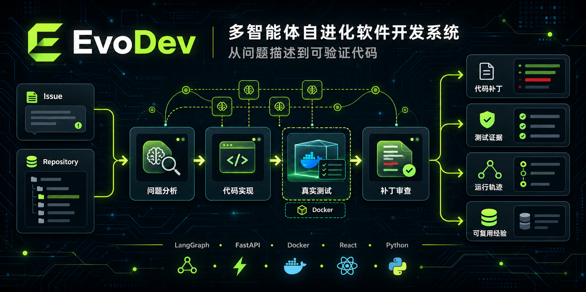
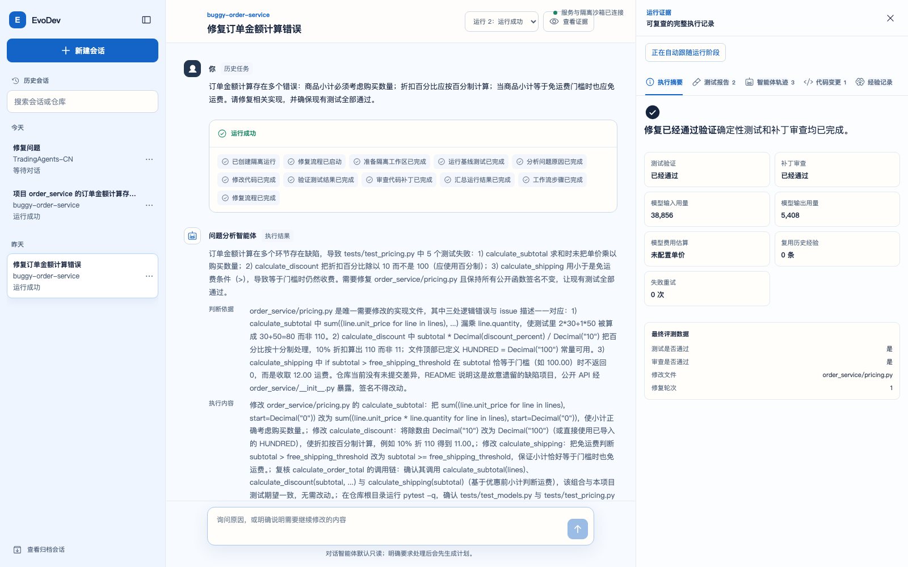

# EvoDev



EvoDev 是一个基于 LangGraph 的多智能体软件修复系统。系统接收本地 Python 仓库、
问题描述和测试命令，在隔离工作区中完成分析、修改、测试和审查，并保留可复查的代码
补丁、测试证据和运行轨迹。失败任务会生成结构化经验，供后续相似任务检索复用。
经验的真实效果会改变后续排序；独立 Worker 还能生成候选 Prompt，通过真实 A/B 评测后
自动升级或拒绝。

Web 控制台采用明亮的对话式智能体工作台布局。用户可以直接描述代码问题，并在设置区
补充仓库、测试命令和修改约束；运行期间可以查看 LangGraph 节点进度，完成后通过选项卡
复查测试报告、智能体轨迹、代码差异和失败经验。任务和运行摘要保存在 PostgreSQL，完整
运行证据保存在 `outputs/`。



## 目录导航

| 路径 | 内容 |
|---|---|
| `docs/` | 项目方案、开发任务清单和系统架构文档 |
| `src/evodev/api/` | FastAPI 应用、依赖、错误处理和接口路由 |
| `src/evodev/application/` | 任务和运行用例的应用服务 |
| `src/evodev/domain/` | 任务、运行、智能体、工作流和经验等核心模型 |
| `src/evodev/workflows/` | LangGraph 状态、节点、路由、工作流定义和编译器 |
| `src/evodev/agents/` | 智能体角色、模型配置和工具权限 |
| `src/evodev/tools/` | 向智能体开放的受控仓库工具接口 |
| `src/evodev/runtime/` | 工作区、命令执行和 Docker 沙箱能力 |
| `src/evodev/evaluation/` | 测试、补丁和整次运行的评测模型 |
| `src/evodev/persistence/` | 业务数据、运行产物和检查点的持久化适配 |
| `src/evodev/observability/` | 运行事件和完整执行轨迹 |
| `tests/` | 后端接口、领域逻辑和工作流测试 |
| `examples/` | 可重复执行的错误代码演示样例 |
| `frontend/` | React 前端应用和组件测试 |
| `sandbox/` | Python 代码执行沙箱镜像 |
| `outputs/` | 按运行编号保存补丁、日志、测试报告和 Agent 轨迹 |
| `data/` | 预留的本地业务数据目录；工作流检查点保存在 PostgreSQL |

## 关键文档

- [系统方案](docs/00-EvoDev_多智能体自进化软件开发系统方案.md)
- [一周开发任务清单](docs/01-一周开发任务清单.md)
- [系统架构设计](docs/02-系统架构设计.md)
- [多智能体闭环说明](docs/03-多智能体闭环说明.md)
- [手动测试指南](docs/04-手动测试指南.md)
- [经验进化说明](docs/05-经验进化说明.md)
- [自进化机制说明](docs/06-自进化机制说明.md)
- [接口与前端联调](docs/07-接口与前端联调.md)
- [前端设计参考](docs/08-前端设计参考.md)
- [前端交互设计](docs/09-前端交互设计.md)
- [交付验收与演示](docs/10-交付验收与演示.md)

## 本地启动

启动后端：

```bash
uv sync --dev
cp .env.example .env
docker compose up -d --wait postgres
uv run evodev doctor
uv run evodev serve
```

后端默认地址为 `http://127.0.0.1:8000`，健康检查地址为
`http://127.0.0.1:8000/api/health`。

执行多智能体修复任务前，需要在 `.env` 中填写模型配置。完整参数和产物说明见
[多智能体闭环说明](docs/03-多智能体闭环说明.md)，端到端验证方法见
[手动测试指南](docs/04-手动测试指南.md)。

Prompt 进化使用独立进程，不阻塞修复任务：

```bash
uv run evodev evolve-prompt --agent developer --min-experiences 1
uv run evodev evolution-worker --once
uv run evodev prompt-versions --agent developer
```

启动前端：

```bash
cd frontend
npm install
npm run dev
```

浏览器访问 `http://127.0.0.1:5173`。页面提交运行后，HTTP 接口会立即返回，后台继续执行
多智能体修复；运行状态和产物会自动刷新。

## 质量检查

```bash
uv run pytest
uv run ruff check .
cd frontend
npm run lint
npm run test
npm run build
```

## 沙箱镜像

```bash
docker build -t evodev-python:3.13 sandbox
```

## 项目标识


## 开源许可证

本项目采用 [MIT License](LICENSE)。
