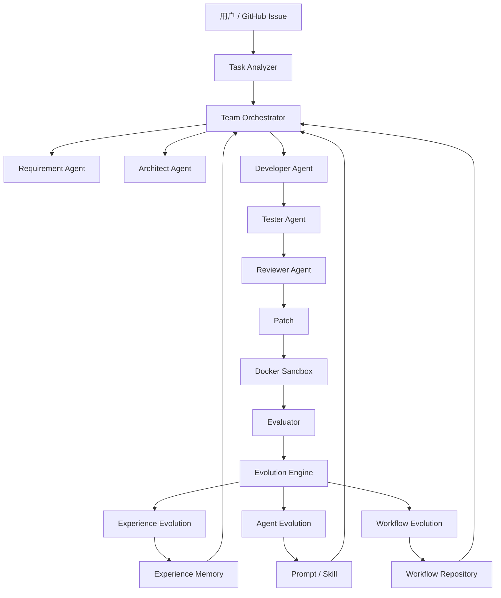

# EvoDev：面向软件开发场景的多智能体自进化系统方案

## 1. 项目背景与目标

本项目拟构建一个面向真实软件开发任务的 **多智能体自进化系统（Self-Evolving Multi-Agent Software Engineering System）**。

项目目标不是简单搭建多个 Agent 进行协作，而是形成一个完整的软件工程闭环：

```text
真实软件任务
   ↓
多智能体协作
   ↓
代码修改 / 测试 / Review
   ↓
自动评测
   ↓
失败分析与经验总结
   ↓
Agent / Skill / Workflow 进化
   ↓
下一轮任务表现提升
```

最终希望项目具备以下特点：

1. 面向真实 GitHub Repository 和 Issue。
2. 多个 Agent 分工完成需求分析、开发、测试、审查等任务。
3. 具备 Docker 隔离执行环境。
4. 能够根据测试结果、代码审查结果和历史轨迹自动评估任务质量。
5. 支持经验、Agent 和 Workflow 三个层级的持续进化。
6. 能够通过 SWE-bench 等 Benchmark 验证进化前后的效果。
7. 最终具备完整运行轨迹、代码 Diff 和进化评测能力，可作为简历项目展示。

---

# 2. 前期调研的主要开源项目

## 2.1 项目整体对比

> Star 数会随时间变化，以下数值仅作为项目成熟度和社区规模参考。

| 项目 | Star 规模（约） | 核心定位 | 典型应用场景 | 多智能体能力 | 自进化能力 | 二创价值 |
|---|---:|---|---|---|---|---|
| **DeerFlow** | 80k+ | 通用 Super Agent | 深度研究、数据分析、编程、内容生成 | 强 | 部分具备 | ★★★★★ |
| **MetaGPT** | 69k+ | 软件工程多智能体 | AI 软件公司、自动软件开发 | 很强 | 可扩展 | ★★★★★ |
| **OpenHands** | 60k+ | 软件开发 Agent | 代码修改、Shell、Repo 操作 | 中 | 弱 | ★★★★☆ |
| **AutoGen** | 60k+ | 通用多智能体框架 | 多 Agent 对话、工具调用、编码 | 很强 | 弱 | ★★★☆☆ |
| **CrewAI** | 50k+ | 企业多 Agent 自动化 | 营销、销售、分析、企业流程 | 强 | 弱 | ★★★★☆ |
| **LangGraph** | 40k+ | Agent Workflow 框架 | 状态型 Agent、复杂工作流 | 强 | 适合自研 | ★★★★★ |
| **ChatDev** | 30k+ | 软件开发多智能体 | 虚拟软件公司、软件工程协作 | 很强 | 较强 | ★★★★★ |
| **AgentScope** | 20k+ | 工程化多智能体平台 | 企业 Agent、RAG、工具调用 | 很强 | 弱 | ★★★★☆ |
| **CAMEL** | 10k+ | Agent Society | 社会模拟、任务自动化、群体智能 | 很强 | 部分涉及 | ★★★★☆ |
| **SWE-agent** | 10k+ | 软件工程 Agent | GitHub Issue 修复 | 弱 | 弱 | ★★★★★ |
| **AgentVerse** | 5k+ | 多 Agent 协作与模拟 | 软件开发、咨询、游戏、社会模拟 | 很强 | 部分涉及 | ★★★☆☆ |
| **EvoAgentX** | 3k+ | 自进化 Agent 框架 | Workflow 优化、股票、论文推荐 | 中 | 很强 | ★★★★★ |
| **AgentEvolver** | 1k+ | RL 驱动 Agent 自进化 | Agent 训练、游戏、多 Agent 推理 | 中 | 很强 | ★★★☆☆ |
| **AFlow** | 数百 | Workflow 自动搜索 | 数学、代码、QA Workflow 优化 | 中 | 很强 | ★★★★★ |
| **EvoMaster** | 数百 | 自进化科研 Agent | AI for Science、Skill 进化 | 中 | 很强 | ★★★★☆ |
| **SiriuS** | 数百 | 经验学习型多智能体 | 科学问答、博弈、经验学习 | 强 | 强 | ★★★★☆ |
| **Meta-Team** | 数十 | 团队级多智能体进化 | 软件工程、团队协作进化 | 很强 | 很强 | ★★★★☆ |
| **SIARE** | 较少 | 自进化 Agentic RAG | 企业知识库、客服、专业研究 | 中 | 强 | ★★★★☆ |

---

# 3. 不同项目的具体应用场景

## 3.1 软件开发场景

| 项目 | 主要用途 |
|---|---|
| **ChatDev** | 多角色虚拟软件公司，完成设计、编码、测试、文档等 |
| **MetaGPT** | 产品经理、架构师、工程师等多 Agent 协同开发软件 |
| **OpenHands** | 修改代码、运行 Shell、操作 Repository、执行真实开发任务 |
| **SWE-agent** | 输入 GitHub Issue，自动分析并生成代码 Patch |
| **Meta-Team** | 软件工程 Agent 团队的协作关系和组织结构进化 |
| **LangGraph** | 自定义复杂软件 Agent Workflow |

对于本项目，软件开发是最合适的业务场景之一，因为任务质量可以通过测试、Bug 修复结果、代码质量和成本等指标直接进行量化。

---

## 3.2 Deep Research / 科研场景

典型项目：

- DeerFlow
- EvoMaster
- EvoAgentX
- SiriuS
- AFlow

这类系统通常用于：

- 文献检索
- Web 搜索
- 数据分析
- 报告生成
- 科学问题求解
- 研究 Workflow 自动优化

---

## 3.3 金融场景

典型项目：

- ATLAS
- MOSAIC
- EvoAgentX

其优势在于存在天然 Reward：

```text
Agent 决策
   ↓
市场结果
   ↓
收益率 / Sharpe Ratio
   ↓
评估 Agent
   ↓
自动进化
```

---

## 3.4 企业自动化场景

典型项目：

- CrewAI
- DeerFlow
- AgentScope
- LangGraph
- SIARE

可用于：

- 销售
- 客服
- 营销
- 会议
- 报告
- 知识库
- 数据分析
- 企业内部 Workflow 自动化

---

## 3.5 Agent Society / 群体模拟

典型项目：

- CAMEL
- AgentVerse
- AgentEvolver
- SiriuS

主要用于研究：

- Agent 协作
- 竞争
- 角色分工
- 社会行为
- 谈判
- 群体智能
- Agent Society Evolution

---

# 4. 最终业务方向选择

经过前期讨论，最终业务场景确定为：

> **基于真实软件开发任务的多智能体自进化系统。**

暂定项目名称：

# EvoDev

完整定位：

> **EvoDev 是一个面向真实 GitHub Repository 和 Issue 的自进化多智能体软件工程系统，通过多个软件工程 Agent 自动完成任务分析、代码修改、测试、Review 和 Bug 修复，并根据历史任务执行结果持续优化经验、Agent Prompt / Skill 和团队 Workflow。**

---

# 5. 为什么选择软件开发场景

软件开发场景非常适合做 Agent Self-Evolution，核心原因是：

## 5.1 结果容易量化

软件开发任务可以直接通过：

- Unit Test
- Integration Test
- Build
- Lint
- Code Review
- Issue Resolve
- Regression Test

判断是否成功。

因此可以形成真正的：

```text
Action
  ↓
Result
  ↓
Reward
  ↓
Reflection
  ↓
Evolution
```

---

## 5.2 有成熟 Benchmark

可以使用：

> **SWE-bench**

SWE-bench 的基本任务形式：

```text
GitHub Repository
        +
GitHub Issue
        ↓
      Agent
        ↓
      Patch
        ↓
Evaluation Harness
        ↓
    Pass / Fail
```

这使得项目可以避免自己编造测试数据，而是直接在真实软件工程任务上评测。

---

# 6. EvoDev 的核心业务流程

一个典型任务：

```text
Repository:
FastAPI Project

Issue:
Token 过期时接口返回 500，
预期应该返回 HTTP 401，
并补充对应测试。
```

系统执行流程如下。

## 6.1 Repository 分析

Repo Analyzer 分析：

- 项目语言
- 框架
- 目录结构
- 测试框架
- 依赖
- 关键模块

例如：

```text
Language: Python
Framework: FastAPI
Test: pytest

app/
tests/
services/
routers/
```

---

## 6.2 Issue 分析

Requirement Agent 提取：

```text
Issue Type: Bug Fix

可能影响：
auth.py
middleware.py

任务：
1. 定位异常
2. 修改 Token Expired 处理逻辑
3. 返回 HTTP 401
4. 增加 Regression Test
```

---

## 6.3 动态组织 Agent

不同任务使用不同 Agent Workflow。

### Bug Fix

```text
Issue Analyzer
      ↓
Developer
      ↓
Tester
      ↓
Reviewer
```

### Feature Development

```text
Requirement
      ↓
Architect
      ↓
Developer
      ↓
Tester
      ↓
Reviewer
      ↓
Document Agent
```

这形成：

> **动态智能体编排（Dynamic Agent Orchestration）**

---

# 7. Agent 角色设计

第一版不需要设计过多 Agent。

建议核心 Agent：

| Agent | 职责 |
|---|---|
| **Task / Requirement Agent** | 理解 Issue、提取需求和约束 |
| **Architect Agent** | 分析模块关系、设计修改方案 |
| **Developer Agent** | 修改代码、实现功能、修复 Bug |
| **Tester Agent** | 生成测试、运行测试、分析失败 |
| **Reviewer Agent** | Code Review、发现逻辑和质量问题 |
| **Debugger Agent** | 分析失败轨迹并进行针对性修复 |
| **Evolution Agent** | 总结经验、优化 Prompt / Skill / Workflow |

MVP 阶段可以只实现：

```text
Requirement
    ↓
Developer
    ↓
Tester
    ↓
Reviewer
```

---

# 8. EvoDev 的三级自进化机制

项目的核心创新不应只是“多个 Agent 协作”，而应该是：

# Experience Evolution + Agent Evolution + Workflow Evolution

---

## 8.1 Level 1：Experience Evolution

第一次任务：

```text
Issue
  ↓
Developer
  ↓
失败
```

失败原因：

```text
修改异常逻辑前，
没有检查项目已有的 Global Exception Handler。
```

Evolution Agent 总结经验：

```text
处理 Web API 异常问题前：

1. 检查 Global Exception Handler
2. 检查 Middleware
3. 搜索已有相关测试
4. 再进行代码修改
```

存储到：

```text
Experience Memory
```

下一次遇到类似任务：

```text
New Issue
   ↓
Retrieve Similar Experience
   ↓
Developer Agent
   ↓
更优决策
```

这不是普通对话 Memory，而是：

> 从任务执行结果中抽象出的可复用软件工程经验。

---

# 9. Level 2：Agent Evolution

Agent 不只是“记住经验”，还可以修改自身能力。

例如：

```text
Developer Agent V1
```

经过 20 个任务：

```text
Test Pass Rate = 58%

主要失败原因：

27% 未运行 Regression Test
21% 修改范围过大
13% 未分析调用链
```

Evolution Engine 根据：

```text
Trajectory
+
Test Result
+
Review Result
```

生成：

```text
Developer Agent V2
```

可以修改：

- Prompt
- Skill
- Tool Policy
- Coding Checklist
- Reasoning Strategy

例如新增 Skill：

```text
代码修改前：

1. Search Symbol References
2. 分析调用关系
3. 检查已有 Tests
4. 最小化 Patch
5. 修改后运行 Regression Tests
```

最终形成：

```text
V1 Test Pass Rate = 58%
        ↓
Evolution
        ↓
V2 Test Pass Rate = 71%
```

---

# 10. Level 3：Workflow Evolution

这是系统最重要的进化能力之一。

初始 Workflow：

```text
Planner
   ↓
Developer
   ↓
Tester
```

假设复杂 Bug 成功率：

```text
45%
```

Evolution Engine 产生多个候选结构。

### Candidate A

```text
Planner
   ↓
Developer
   ↓
Reviewer
   ↓
Tester
```

成功率：

```text
61%
```

### Candidate B

```text
        ┌→ Developer A ─┐
Planner                  Reviewer → Tester
        └→ Developer B ─┘
```

成功率：

```text
68%
```

最终保留 Candidate B。

即：

> 系统不只优化 Agent 本身，还能优化 Agent 团队结构和协作方式。

---

# 11. Workflow Evolution 的实现思路

第一版不建议直接上复杂强化学习。

可以采用：

```text
LLM Mutation
     +
Evaluation
     +
Tournament Selection
```

类似遗传算法：

```text
Workflow V1
     │
 ┌───┼────┐
 ▼   ▼    ▼
V1.1 V1.2 V1.3
 │    │    │
 └────┼────┘
      ↓
 Evaluation
      ↓
    Best
      ↓
 Workflow V2
```

后续再考虑：

- MCTS
- Reinforcement Learning
- Policy Optimization
- Evolutionary Search

---

# 12. 自动评测系统

没有 Evaluation，就无法证明 Evolution 有效。

软件开发任务天然适合构建自动评测体系。

建议核心指标如下：

| 指标 | 含义 |
|---|---|
| **Resolve Rate** | GitHub Issue 是否真正被解决 |
| **Test Pass Rate** | 新旧测试通过率 |
| **Regression Rate** | 修改是否破坏已有功能 |
| **Retry Count** | 平均需要重试多少次 |
| **Review Score** | Code Review 质量评分 |
| **Patch Size** | 修改代码规模 |
| **Token Cost** | LLM Token / API 成本 |
| **Latency** | 完成任务耗时 |
| **Agent Calls** | Agent 调用次数 |
| **Build Success Rate** | 项目是否成功构建 |

---

# 13. 进化效果实验

最终项目必须证明：

> Agent V2 确实优于 Agent V1。

可以设计如下对照实验：

| 系统 | Resolve Rate | Test Pass Rate | Avg Cost | Avg Retry |
|---|---:|---:|---:|---:|
| Baseline | 42% | 57% | $1.42 | 4.1 |
| + Experience Evolution | 51% | 64% | $1.35 | 3.5 |
| + Agent Evolution | 61% | 72% | $1.27 | 2.9 |
| + Workflow Evolution | **68%** | **79%** | **$1.18** | **2.4** |

> 上述数据仅表示未来希望形成的实验展示形式，实际数据需要在系统开发完成后通过 Benchmark 得到。

---

# 14. 系统总体架构



---

# 15. 分层技术架构

```text
FastAPI Backend
────────────────────────
         │
         ▼
Agent Orchestration Layer
│
├── Requirement Agent
├── Architect Agent
├── Developer Agent
├── Tester Agent
├── Reviewer Agent
└── Debugger Agent
         │
         ▼
Evolution Engine
│
├── Experience Evolver
├── Prompt Evolver
├── Skill Evolver
└── Workflow Evolver
         │
         ▼
Memory Layer
│
├── Task Memory
├── Experience Memory
├── Failure Memory
├── Skill Library
└── Workflow Repository
         │
         ▼
Execution Runtime
│
├── Docker Sandbox
├── Git
├── Shell
├── Python
├── Node.js
├── pytest
└── npm test
         │
         ▼
Evaluation
│
├── SWE-bench
├── Unit Test
├── Lint
├── Code Review
├── Cost
└── Latency
```

---

# 16. 推荐技术栈

| 模块 | 技术建议 |
|---|---|
| Agent Backend | Python |
| API | FastAPI |
| Agent Framework | ChatDev 二创 / LangGraph |
| LLM Adapter | LiteLLM |
| Sandbox | Docker |
| Git | GitPython |
| Database | PostgreSQL |
| Vector Memory | pgvector / Qdrant |
| Cache | Redis |
| Task Queue | Celery + Redis |
| Trace | Langfuse / 自研 Trace |
| Evaluation | SWE-bench + pytest |
| Data Analysis | Pandas |

第一版不建议过早引入：

- Kubernetes
- Kafka
- 复杂微服务
- 大规模分布式系统

---

# 17. 各开源项目在 EvoDev 中可以借鉴什么

与其完整 Fork 一个项目，不如“按模块借鉴”。

```text
ChatDev / MetaGPT
        ↓
多智能体软件开发协作

OpenHands / SWE-agent
        ↓
真实代码执行与 GitHub Issue 处理

SWE-bench
        ↓
软件工程 Benchmark

AFlow / EvoAgentX
        ↓
Workflow Evolution

SiriuS
        ↓
Experience Learning

Meta-Team
        ↓
Agent / Interaction / Team 多层进化
```

---

# 18. 为什么目前优先研究 ChatDev

在软件开发场景下，ChatDev 比通用 Agent Framework 更贴近 EvoDev。

ChatDev 已经具有：

```text
软件开发
+
Multi-Agent
+
Experience Learning
+
Dynamic Orchestration
```

其发展路线中已经包含：

- 虚拟软件公司
- 多 Agent 软件开发
- Experiential Co-Learning
- Evolving Orchestration

因此适合作为软件开发 Multi-Agent 体系的重要源码参考。

但是 EvoDev 不能只是：

> Fork ChatDev + 更换外层包装。

而应该将 ChatDev 视为：

> 软件开发 Agent 协作模块的参考实现。

真正需要自行设计的核心应该包括：

- Evolution Engine
- Evaluation System
- Experience Memory
- Agent Versioning
- Workflow Evolution
- Evolution Metrics

---

# 19. 开源项目阅读策略

目前不建议先把所有源码完整读完，也不建议完全不看源码就把正式架构设计死。

最佳路线是：

> **先确定粗架构 → 带着问题读源码 → 再重新设计正式架构。**

---

## 19.1 阶段一：先确定粗架构

目前只需要明确：

```text
GitHub Issue
    ↓
Multi-Agent
    ↓
Code / Test
    ↓
Evaluation
    ↓
Evolution
```

以及：

```text
Experience Evolution
Agent Evolution
Workflow Evolution
```

---

## 19.2 阶段二：带着问题读源码

### 阅读 ChatDev

重点回答：

- Agent 如何定义？
- Agent 如何通信？
- 软件开发任务如何拆解？
- Workflow 如何调度？
- Message 如何传递？
- 历史经验如何保存？
- Experience Learning 如何实现？
- Dynamic Orchestrator 如何工作？

---

### 阅读 OpenHands

重点研究：

- Repository 如何加载？
- Agent 如何修改代码？
- Shell 如何执行？
- Docker Sandbox 如何实现？
- 文件系统权限如何控制？
- Patch 如何生成？
- 执行结果如何回传？

---

### 阅读 SWE-agent

重点研究：

- GitHub Issue 如何进入 Agent？
- Repo Environment 如何构建？
- Agent 如何搜索代码？
- Agent 如何修改文件？
- Patch 如何生成？
- Evaluation 如何判断任务成功？

---

### 阅读 SWE-bench

重点研究：

- Benchmark Dataset
- Docker Environment
- Test Patch
- Gold Patch
- Evaluation Harness
- Resolve 判断逻辑

---

### 阅读 AFlow / EvoAgentX

重点研究：

- Workflow 如何表示？
- Workflow 如何 Mutation？
- Candidate Workflow 如何生成？
- Evaluation 如何进行？
- Best Workflow 如何选择？
- Workflow Version 如何保存？

---

### 阅读 SiriuS / Meta-Team

重点研究：

- Experience 如何总结？
- Failure Reflection 如何生成？
- Experience Library 如何维护？
- Agent-Level Evolution
- Interaction-Level Evolution
- Team-Level Evolution

---

# 20. 建议的开发顺序

最重要的原则：

> **先做稳定的软件开发 Agent，再做自进化。**

不要一开始就实现复杂 Evolution。

---

## EvoDev V0：基础 Multi-Agent Software Engineer

目标：

```text
Issue
 ↓
理解 Repository
 ↓
分析问题
 ↓
修改代码
 ↓
运行测试
 ↓
生成 Patch
```

这一阶段先使用固定 Workflow。

---

## EvoDev V1：Experience Evolution

增加：

```text
Task
 ↓
Result
 ↓
Reflection
 ↓
Experience
 ↓
Memory
```

---

## EvoDev V2：Agent Evolution

增加：

```text
Prompt Evolution
Skill Evolution
Tool Policy Evolution
```

---

## EvoDev V3：Workflow Evolution

增加：

```text
Workflow Mutation
Evaluation
Selection
Versioning
```

---

## EvoDev V4：Benchmark 与评测报告

增加：

- SWE-bench
- Evolution Curve
- Resolve Rate
- Test Pass Rate
- Cost
- Retry Count
- Agent Trace
- Workflow Metrics

---

# 21. 推荐项目推进路线

| 阶段 | 工作内容 | 产出 |
|---|---|---|
| **1** | 明确项目目标与粗架构 | Project Definition |
| **2** | 阅读关键开源项目 | 源码分析笔记 |
| **3** | 对比不同实现 | 技术选型表 |
| **4** | 重新设计 EvoDev | 正式系统架构 |
| **5** | 实现 V0 | Issue → Patch → Test |
| **6** | 实现 Experience Evolution | V1 |
| **7** | 实现 Agent Evolution | V2 |
| **8** | 实现 Workflow Evolution | V3 |
| **9** | 接入 SWE-bench | Benchmark |
| **10** | 完成交付材料与演示验证 | 简历展示版本 |

---

# 22. 项目最终需要体现的核心价值

最终不能只证明：

> 系统能够调用多个 Agent。

而应该证明：

> **系统能够通过历史任务反馈持续提高自身的软件工程能力。**

最终最好形成：

```text
Agent Team V1
      ↓
执行真实任务
      ↓
Evaluation
      ↓
Reflection
      ↓
Evolution
      ↓
Agent Team V2
      ↓
Benchmark 提升
```

---

# 23. 简历项目描述方向

未来完成项目后，可以将项目描述为：

> **EvoDev — 自进化多智能体软件工程平台**  
> 面向真实 GitHub Issue 构建多智能体软件开发系统，设计 Requirement、Architect、Developer、Tester、Reviewer 等 Agent，实现需求分析、代码生成、自动测试、Code Review 与迭代修复闭环；设计基于执行轨迹、测试结果与代码审查反馈的三级自进化机制，实现 Experience、Agent Prompt / Skill 与 Workflow Topology 的持续优化；基于 Docker 构建隔离代码执行环境，并接入 SWE-bench 构建自动评测体系，对 Resolve Rate、Test Pass Rate、Token Cost、Agent Calls 等指标进行量化评估。

项目真正有说服力的最终结果应该是：

```text
在 N 个真实软件工程任务上：

Baseline Resolve Rate     = XX%
EvoDev Resolve Rate       = XX%

Test Pass Rate            ↑ XX%
Average Retry             ↓ XX%
Token Cost                ↓ XX%
```

这些实验数据将直接体现自进化机制的实际价值。

---

# 24. 当前阶段的最优行动

目前不应该直接进入完整系统开发，也不应该先设计非常详细的最终架构。

最合理的路线是：

```text
先确定 EvoDev 粗架构
        ↓
阅读 ChatDev
        ↓
阅读 OpenHands / SWE-agent
        ↓
阅读 SWE-bench
        ↓
阅读 AFlow / EvoAgentX
        ↓
阅读 SiriuS / Meta-Team
        ↓
重新设计正式系统架构
        ↓
实现 EvoDev V0
```

当前最优先需要完成的是：

> **EvoDev V0.1 的系统边界、核心模块和最小可运行闭环设计。**

即首先确保：

```text
GitHub Issue
    ↓
Repo Understanding
    ↓
Developer Agent
    ↓
Code Modification
    ↓
Test
    ↓
Patch
```

能够稳定运行。

在此基础上，再逐步加入：

```text
Experience Evolution
        ↓
Agent Evolution
        ↓
Workflow Evolution
```

最终形成真正具备工程价值、研究价值和简历展示价值的：

# Self-Evolving Multi-Agent Software Engineering System
