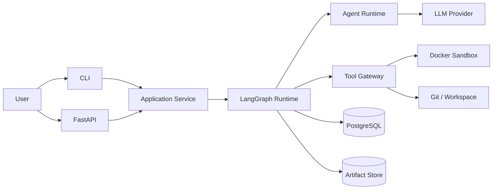
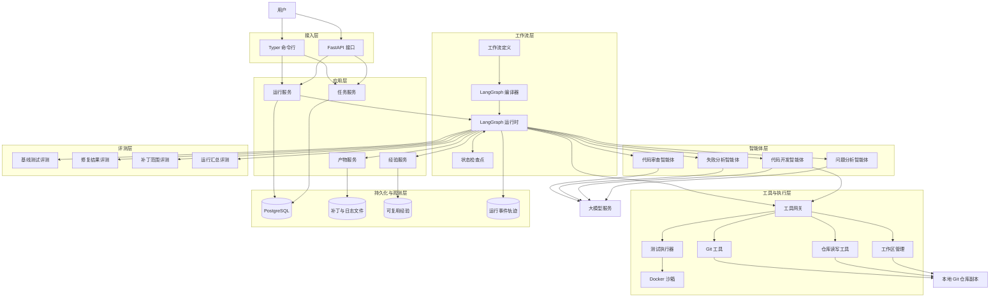
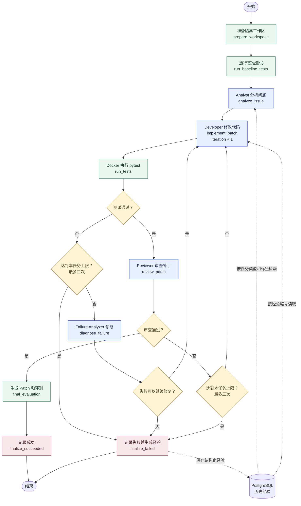
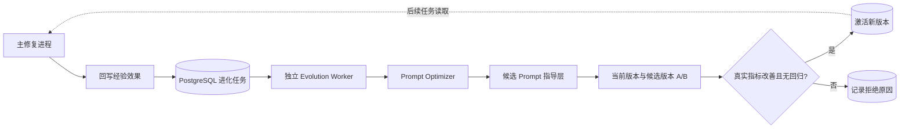
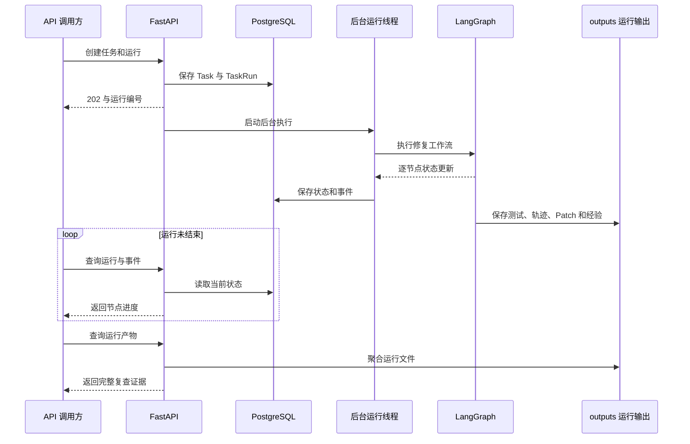

# EvoDev 首版系统架构设计

## 1. 文档信息

- 文档用途：说明首版系统的边界、模块、数据和运行流程
- 状态：已冻结
- 适用期限：2026 年 9 月 1 日至 9 月 6 日
- 目标：在一周内交付可运行、可演示、可验证的多智能体软件修复系统

## 2. 系统要解决的问题

EvoDev 首版不以“创建多个 Agent”为最终目标，而是解决以下问题：

> 如何让 Agent 在真实代码仓库中形成可执行、可验证、可回溯的软件修复闭环，并为后续经验学习和自进化保留结构化数据。

核心产品闭环：

```text
本地 Git 仓库 + Issue + 测试命令
                  ↓
              仓库准备
                  ↓
              Issue 分析
                  ↓
              代码修改
                  ↓
              真实测试
                  ↓
        失败分析与有限次修复
                  ↓
              Patch Review
                  ↓
      Patch + 测试证据 + 完整轨迹
```

## 3. 首版范围

### 3.1 支持范围

- 本地 Git 仓库。
- Python 3.13 项目。
- `pytest` 测试体系。
- 用户显式提供的 Issue 文本和测试命令。
- 单机、单任务 Worker。
- Docker 隔离执行。
- 固定的 Bug Fix Workflow。
- 最多三次自动修复。
- 基于标签的 Experience 存储和检索。

### 3.2 不在范围内

- 从 GitHub 自动接收 Issue 或提交 PR。
- 多语言仓库。
- 并行执行多个任务。
- 生产级账号、权限和多租户。
- Prompt、Skill 和 Workflow 的自动进化。
- SWE-bench 全量评测。
- 分布式执行和云端部署。

## 4. 架构原则

1. **Agent 只负责需要推理的工作**，测试、Git、文件和命令执行由确定性服务完成。
2. **最终结果由真实测试决定**，LLM Reviewer 不能单独宣告任务成功。
3. **原始仓库不被修改**，所有写操作发生在任务工作区中。
4. **工作流显式化**，分支、循环、重试与终止条件由 LangGraph 表达。
5. **业务模型不依赖 LangGraph**，通过 `WorkflowSpec` 和编译层将 EvoDev 业务对象转换为 Graph。
6. **状态与大文件分离**，Graph State 保存结构化状态和 Artifact ID，大型日志保存在 Artifact Store。
7. **所有步骤可回溯**，Agent、Prompt、Workflow、工具和评测结果都必须带版本与运行标识。
8. **有界运行**，Agent 调用、命令执行和修复循环都有预算、超时或次数限制。

## 5. 系统架构图

### 5.1 系统上下文图



上下文图用于说明 EvoDev 与用户、模型服务、代码仓库和本地运行环境之间的关系。

### 5.2 系统总体架构图

该图展示 EvoDev 从接收代码修复任务到产出可验证结果的完整技术链路，以及各层之间如何分工协作。系统采用模块化单体架构，各业务模块运行在同一个后端进程中，便于首版快速开发、调试和部署。

用户通过 HTTP API 或命令行提交仓库路径、问题描述和测试命令，应用服务随后启动 LangGraph 工作流，由工作流按照“分析问题、实现补丁、运行测试、诊断失败、审查补丁”的顺序调度不同智能体和确定性节点。智能体只负责分析和决策，仓库读写、Git 操作和测试执行必须经过工具网关，并在隔离的 Docker 沙箱与任务工作区中完成，避免直接修改原始仓库。

运行过程中，评测层根据真实测试结果、补丁范围、重试次数和执行成本判断修复质量；持久化与观测层则保存任务状态、代码补丁、测试日志、可复用经验和完整运行轨迹，使每次修复都能够查询、复查和追溯。



总体架构采用模块化单体：各层在同一个后端进程中协作，Docker 沙箱仅负责隔离命令和测试执行。图中的“本地 Git 仓库副本”是任务工作区，原始仓库始终保持只读和不变。

## 6. 分层架构

### 6.1 接入层

- FastAPI：提供 HTTP API 和健康检查。
- Typer CLI：提供本地调试和任务执行入口。

### 6.2 应用层

- TaskService：创建任务、校验输入。
- RunService：启动、查询和取消 TaskRun。
- ArtifactService：保存与读取 Patch、日志和测试报告。
- ExperienceService：存储和检索可复用经验。

### 6.3 工作流层

- WorkflowSpec：EvoDev 自有的声明式工作流定义。
- LangGraphCompiler：将 WorkflowSpec 编译为 `StateGraph`。
- Nodes：封装 Agent 或确定性业务步骤。
- Routers：根据测试、Review 和迭代次数选择下一节点。
- Checkpointer：保存每个 TaskRun 的 Graph 状态。

### 6.4 Agent 层

- Analyst Agent：需求理解、定位相关代码、输出修改计划。
- Developer Agent：使用受控工具搜索、读取、修改和检查代码。
- Failure Analyzer：根据命令输出和测试日志提取失败原因与修复建议。
- Reviewer Agent：评估需求覆盖、Patch 范围、测试覆盖和回归风险。

### 6.5 工具与执行层

- WorkspaceManager：仓库校验、任务工作区和清理。
- RepositoryTools：文件树、文本搜索和文件读取。
- EditTools：受控 Patch 应用。
- GitTools：基准 Commit、Diff、变更文件和 Patch。
- CommandRunner：命令执行、超时、输出截断和退出码。
- DockerSandbox：隔离运行命令和测试。

### 6.6 评测层

- BaselineEvaluator：记录修改前测试状态。
- TestEvaluator：解析目标测试和回归测试。
- PatchEvaluator：统计变更文件、行数和 Patch 大小。
- RunEvaluator：汇总成功状态、耗时、Token 和重试次数。

### 6.7 持久化与观测层

- PostgreSQL：任务、运行、Agent 版本、Workflow 版本、Experience 和指标。
- PostgreSQL Checkpointer：LangGraph 线程状态。
- Artifact Store：日志、Patch、测试报告和较大输出。
- Event Trace：按时间记录节点、Agent、工具和状态变化。

## 7. LangGraph 工作流

下图按照当前代码中的节点和路由绘制。矩形表示执行节点，菱形表示由确定性代码完成的
条件判断；只有 Analyst、Developer、Failure Analyzer 和 Reviewer 会调用大模型。
`iteration` 在每次进入 Developer 时加一，测试失败或审查不通过都只能在
`iteration < max_iterations` 时再次修改，首版 `max_iterations` 最大为 3。



### 7.1 状态转换

```text
CREATED
→ PREPARING
→ BASELINE_TESTING
→ ANALYZING
→ IMPLEMENTING
→ TESTING
→ DEBUGGING | REVIEWING | FAILED
→ IMPLEMENTING | FINALIZING
→ SUCCEEDED | FAILED | CANCELLED
```

| 状态 | 中文含义 |
|---|---|
| `CREATED` | 运行记录已创建 |
| `PREPARING` | 正在准备隔离工作区 |
| `BASELINE_TESTING` | 正在执行修改前的基线测试 |
| `ANALYZING` | 正在分析问题和仓库 |
| `IMPLEMENTING` | 正在修改代码 |
| `TESTING` | 正在执行修改后的测试 |
| `DEBUGGING` | 正在分析测试失败原因 |
| `REVIEWING` | 正在审查补丁质量和需求覆盖 |
| `FINALIZING` | 正在汇总评测结果和运行产物 |
| `SUCCEEDED` | 测试和审查均已通过 |
| `FAILED` | 运行失败或修复次数已达到上限 |
| `CANCELLED` | 运行被用户取消 |

### 7.2 路由规则

- 测试通过：进入 Review。
- 测试失败且 `iteration < max_iterations`：进入 Failure Analyzer。
- 测试失败且达到限制：任务失败。
- Failure Analyzer 判断不可继续修复：任务直接失败并保存原因。
- Review 通过：进入最终评测。
- Review 不通过且尚有重试额度：返回 Developer。
- 收到取消信号：进入 `CANCELLED`。
- 不可恢复的基础设施错误：进入 `FAILED` 并保留原因。
- 失败终止：从已有问题分析和失败诊断生成 Experience，并幂等保存到 PostgreSQL。
- 开始问题分析：按任务类型和标签检索最多三条经验，注入 Analyst 和 Developer。

### 7.3 异步 Prompt 进化

Prompt 进化不属于主修复 LangGraph。主任务结束后只回写 Experience 效果；独立 Worker 从
PostgreSQL 领取进化任务，生成候选指导层并执行真实 Bug A/B 评测。候选通过门槛后才原子
激活，且只影响后续新任务。



## 8. Graph State

```python
class EvoDevState(TypedDict):
    run_id: str
    task_id: str
    status: str

    repository_path: str
    workspace_path: str | None
    base_commit: str | None
    issue_title: str
    issue_body: str
    test_command: str

    repository_summary: dict | None
    issue_analysis: dict | None
    implementation_plan: dict | None
    failure_analysis: dict | None
    review_result: dict | None

    baseline_result_id: str | None
    test_result_id: str | None
    patch_artifact_id: str | None
    evaluation_result_id: str | None

    changed_files: list[str]
    retrieved_experience_ids: list[str]
    generated_experience_id: str | None

    iteration: int
    max_iterations: int
    workflow_version: str
    agent_versions: dict[str, str]
    prompt_tokens: int
    completion_tokens: int
    retry_count: int
    duration_ms: int
    tests_passed: bool | None
    review_passed: bool | None
    error_code: str | None
    error_message: str | None
```

| 字段 | 中文含义 |
|---|---|
| `run_id` | 本次运行的唯一标识 |
| `task_id` | 所属任务的唯一标识 |
| `status` | 当前运行状态 |
| `repository_path` | 用户提供的原始仓库路径 |
| `workspace_path` | 本次运行使用的隔离工作区路径 |
| `base_commit` | 开始修改前的 Git 提交标识 |
| `issue_title` | 问题标题 |
| `issue_body` | 问题详情和验收要求 |
| `test_command` | 用户指定的测试命令 |
| `repository_summary` | 仓库结构和关键信息摘要 |
| `issue_analysis` | 问题分析结果 |
| `implementation_plan` | 代码修改计划 |
| `failure_analysis` | 测试失败原因和修复建议 |
| `review_result` | 补丁审查结果 |
| `baseline_result_id` | 修改前测试结果的产物标识 |
| `test_result_id` | 修改后测试结果的产物标识 |
| `patch_artifact_id` | Git 补丁文件的产物标识 |
| `evaluation_result_id` | 最终评测结果的标识 |
| `changed_files` | 本次运行修改的文件列表 |
| `retrieved_experience_ids` | 本次运行参考的历史经验标识列表 |
| `generated_experience_id` | 失败运行生成的经验标识；未生成时为空 |
| `iteration` | 已执行的自动修复次数 |
| `max_iterations` | 允许的最大自动修复次数，首版固定上限为 3 |
| `workflow_version` | 本次运行使用的工作流版本 |
| `agent_versions` | 实际调用的 Agent、模型和提示词版本 |
| `prompt_tokens` | 本次运行消耗的输入 Token 总数 |
| `completion_tokens` | 本次运行消耗的输出 Token 总数 |
| `retry_count` | 首次修改后再次修改的次数 |
| `duration_ms` | 完整工作流耗时，单位为毫秒 |
| `tests_passed` | 测试是否通过；未运行时为空 |
| `review_passed` | 补丁审查是否通过；未审查时为空 |
| `error_code` | 结构化错误代码 |
| `error_message` | 便于定位问题的错误说明 |

Graph State 不保存：

- 完整仓库文件内容。
- 完整测试日志。
- 大型 Git Diff。
- 完整 Agent 上下文。

这些数据由 Artifact Store 保存，State 只保存 ID 和摘要。

当前 `run_id` 同时作为 Checkpointer 的 `thread_id`，只支持一次修复运行内部的状态共享。
首版尚未定义用户聊天会话及消息历史，因此不能把不同修复运行自动合并成同一会话记忆。

## 9. 节点输入输出契约

| 节点 | 类型 | 主要输入 | 主要输出 |
|---|---|---|---|
| `prepare_workspace`（准备工作区） | 确定性 | 原始仓库路径 | 工作区路径、基准提交 |
| `run_baseline_tests`（运行基线测试） | 确定性 | 工作区路径、测试命令 | 基线测试结果标识 |
| `analyze_issue`（分析问题） | 智能体 | 问题描述、仓库摘要、历史经验 | 问题分析、修改计划 |
| `implement_patch`（实现补丁） | 智能体子图 | 修改计划、失败分析、受控工具 | 变更文件、补丁产物标识 |
| `run_tests`（运行修复后测试） | 确定性 | 工作区路径、测试命令 | 测试结果标识 |
| `diagnose_failure`（诊断失败） | 智能体 | 测试摘要、代码差异、修改计划 | 失败原因和修复建议 |
| `review_patch`（审查补丁） | 智能体 | 问题描述、代码差异摘要、测试结果 | 补丁审查结果 |
| `final_evaluation`（最终评测） | 确定性 | 测试、补丁、轨迹和成本 | 最终评测结果标识 |
| `finalize_succeeded`（记录成功） | 确定性 | 评测结果 | 成功状态 |
| `finalize_failed`（记录失败） | 确定性 | 错误和已有产物 | 失败状态 |

## 10. Agent 定义

```python
class AgentDefinition:
    id: str
    name: str
    role: str
    prompt_file: str
    prompt_version: str
    model: str
    temperature: float
    allowed_tools: list[str]
    output_schema: str
    max_tool_calls: int
    timeout_seconds: int
```

| 字段 | 中文含义 |
|---|---|
| `id` | 智能体定义的唯一标识 |
| `name` | 智能体名称 |
| `role` | 智能体负责的工作角色 |
| `prompt_file` | 独立维护的系统提示词模板文件 |
| `prompt_version` | 当前使用的提示词版本 |
| `model` | 调用的大模型名称 |
| `temperature` | 控制模型输出随机程度的参数 |
| `allowed_tools` | 允许该智能体调用的工具列表 |
| `output_schema` | 智能体输出必须满足的数据结构 |
| `max_tool_calls` | 单次运行允许调用工具的最大次数 |
| `timeout_seconds` | 单次调用的最长等待时间，单位为秒 |

约束：

- Agent 不能访问未授权工具。
- Agent 结果必须通过 Pydantic Schema 校验。
- Agent 不能以自然语言宣告测试成功。
- Agent 调用记录模型、Prompt 版本、Token、耗时和工具调用。
- Developer 的文件写入必须通过 Tool Gateway。

## 11. 核心数据模型

### 11.1 Task

`Task` 表示用户提交的一项代码修复任务。

| 字段 | 中文含义 |
|---|---|
| `id` | 任务唯一标识 |
| `repository_path` | 待修复的本地 Git 仓库绝对路径 |
| `issue_title` | 问题标题 |
| `issue_body` | 问题详情和验收要求 |
| `test_command` | 用于验证修复结果的测试命令 |
| `constraints` | 用户要求遵守的额外限制 |
| `created_at` | 任务创建时间 |

### 11.2 TaskRun

`TaskRun` 表示某个任务的一次完整执行。同一个任务可以多次运行。

| 字段 | 中文含义 |
|---|---|
| `id` | 运行唯一标识 |
| `task_id` | 所属任务标识 |
| `status` | 当前运行状态 |
| `workflow_version_id` | 本次运行使用的工作流定义标识 |
| `started_at` | 开始执行时间 |
| `finished_at` | 结束执行时间 |
| `current_node` | 当前正在执行的工作流节点 |
| `iteration` | 已执行的自动修复次数 |
| `max_iterations` | 允许的最大自动修复次数，不能超过 3 |
| `error_code` | 失败时的结构化错误代码 |
| `error_message` | 失败时的错误说明 |

### 11.3 AgentVersion

`AgentVersion` 记录智能体配置，保证每次运行都能追溯当时使用的模型、提示词和工具权限。

| 字段 | 中文含义 |
|---|---|
| `id` | 智能体版本唯一标识 |
| `agent_name` | 智能体名称 |
| `version` | 智能体配置版本 |
| `prompt_version` | 提示词版本 |
| `model` | 使用的大模型名称 |
| `tool_policy` | 允许调用的工具及其限制 |
| `created_at` | 该版本创建时间 |

### 11.4 AgentInvocation

`AgentInvocation` 记录一次智能体调用的输入、输出、成本和结果。

| 字段 | 中文含义 |
|---|---|
| `id` | 调用记录唯一标识 |
| `run_id` | 所属运行标识 |
| `agent_version_id` | 使用的智能体版本标识 |
| `node_name` | 发起调用的工作流节点 |
| `input_artifact_id` | 完整输入内容的产物标识 |
| `output_artifact_id` | 完整输出内容的产物标识 |
| `prompt_tokens` | 输入消耗的 Token 数量 |
| `completion_tokens` | 输出消耗的 Token 数量 |
| `duration_ms` | 调用耗时，单位为毫秒 |
| `status` | 调用状态 |
| `created_at` | 调用开始记录的时间 |

### 11.5 ToolInvocation

`ToolInvocation` 记录一次受控工具调用，便于复查智能体实际执行了什么操作。

| 字段 | 中文含义 |
|---|---|
| `id` | 工具调用唯一标识 |
| `run_id` | 所属运行标识 |
| `agent_invocation_id` | 发起调用的智能体调用标识；系统节点调用时可为空 |
| `tool_name` | 工具名称 |
| `arguments_summary` | 已隐藏敏感信息的参数摘要 |
| `result_artifact_id` | 完整执行结果的产物标识 |
| `exit_code` | 命令退出码；非命令工具可为空 |
| `duration_ms` | 调用耗时，单位为毫秒 |
| `status` | 调用状态 |
| `created_at` | 调用时间 |

### 11.6 TestExecution

`TestExecution` 保存修改前或修改后的真实测试证据。

| 字段 | 中文含义 |
|---|---|
| `id` | 测试执行唯一标识 |
| `run_id` | 所属运行标识 |
| `kind` | 测试类型，例如基线测试或修复后测试 |
| `command` | 实际执行的测试命令 |
| `exit_code` | 测试命令退出码 |
| `passed` | 测试是否通过 |
| `duration_ms` | 测试耗时，单位为毫秒 |
| `output_artifact_id` | 完整测试输出的产物标识 |
| `created_at` | 测试执行时间 |

### 11.7 Experience

`Experience` 保存从已完成运行中提炼出的可复用经验。

| 字段 | 中文含义 |
|---|---|
| `id` | 经验唯一标识 |
| `source_run_id` | 产生该经验的运行标识 |
| `task_type` | 适用的任务类型 |
| `tags` | 用于检索经验的标签 |
| `failure_pattern` | 可识别的失败现象或模式 |
| `lesson` | 从运行中总结出的经验结论 |
| `recommended_actions` | 再次遇到相似问题时建议采取的操作 |
| `usage_count` | 该经验被检索使用的次数 |
| `success_count` | 使用经验后业务任务成功的次数 |
| `failure_count` | 使用经验后业务修复失败的次数 |
| `quality_score` | 带先验的经验有效性评分 |
| `status` | 是否继续参与自动检索 |
| `last_used_at` | 最近一次注入时间 |
| `created_at` | 经验创建时间 |

`evodev_experience_usages` 使用 `experience_id + run_id` 联合主键记录经验被哪次运行使用，
从而保证 LangGraph 节点重放不会重复增加 `usage_count`。

### 11.8 PromptVersion 与 PromptEvolutionJob

`PromptVersion` 保存可进化指导层、来源经验、A/B 结果和激活状态；基础角色、安全规则、工具
权限和输出 Schema 仍由仓库中的固定 Prompt 管理。`PromptEvolutionJob` 是独立 Worker 使用
的 PostgreSQL 任务队列记录，包含目标 Agent、状态、候选版本、错误信息和起止时间。

### 11.9 EvaluationResult

`EvaluationResult` 汇总本次运行是否解决问题，以及补丁规模、成本和耗时。

| 字段 | 中文含义 |
|---|---|
| `id` | 评测结果唯一标识 |
| `run_id` | 所属运行标识 |
| `resolved` | 是否满足最终成功条件 |
| `baseline_passed` | 修改前的基线测试是否通过 |
| `tests_passed` | 修改后的测试是否通过 |
| `review_passed` | 补丁审查是否通过 |
| `changed_files_count` | 修改的文件数量 |
| `added_lines` | 新增代码行数 |
| `deleted_lines` | 删除代码行数 |
| `retry_count` | 自动修复重试次数 |
| `prompt_tokens` | 所有模型调用的输入 Token 总数 |
| `completion_tokens` | 所有模型调用的输出 Token 总数 |
| `duration_ms` | 整次运行耗时，单位为毫秒 |
| `created_at` | 评测结果创建时间 |

## 12. API 草案

### 12.1 系统

| 方法 | 路径 | 说明 |
|---|---|---|
| GET | `/api/health` | 健康检查 |

### 12.2 任务

| 方法 | 路径 | 说明 |
|---|---|---|
| POST | `/api/tasks` | 创建任务 |
| GET | `/api/tasks` | 查询任务列表 |
| GET | `/api/tasks/{task_id}` | 查询任务详情 |
| POST | `/api/tasks/{task_id}/runs` | 启动一次执行 |

### 12.3 运行

| 方法 | 路径 | 说明 |
|---|---|---|
| GET | `/api/runs/{run_id}` | 查询运行状态 |
| POST | `/api/runs/{run_id}/cancel` | 取消运行 |
| GET | `/api/runs/{run_id}/events` | 查询执行事件 |
| GET | `/api/runs/{run_id}/tests` | 查询测试记录 |
| GET | `/api/runs/{run_id}/diff` | 查询 Git Diff |
| GET | `/api/runs/{run_id}/evaluation` | 查询最终评测 |

### 12.4 Experience

| 方法 | 路径 | 说明 |
|---|---|---|
| GET | `/api/experiences` | 查询经验列表 |
| GET | `/api/experiences/{experience_id}` | 查询经验详情 |

### 12.5 创建任务请求

```json
{
  "repository_path": "/absolute/path/to/repository",
  "issue_title": "过期令牌错误返回 HTTP 500",
  "issue_body": "应返回 HTTP 401，并增加回归测试。",
  "test_command": "pytest -q",
  "constraints": ["保持补丁范围最小"],
  "max_iterations": 3
}
```

| 请求字段 | 中文含义 |
|---|---|
| `repository_path` | 待修复仓库的绝对路径 |
| `issue_title` | 问题标题 |
| `issue_body` | 问题详情和验收要求 |
| `test_command` | 用于验证修复结果的测试命令 |
| `constraints` | 修复过程必须遵守的额外限制 |
| `max_iterations` | 最大自动修复次数，默认值和允许的最大值均为 3 |

## 13. Docker 沙箱方案

### 13.1 执行模式

- 每个 TaskRun 创建独立工作区。
- 工作区以读写方式挂载到容器 `/workspace`。
- 代码读写与测试均针对该任务工作区。
- 基础镜像使用 `python:3.13-slim`。
- 首版允许在准备阶段安装任务依赖，正式执行阶段默认关闭网络。

### 13.2 默认限制

| 配置项 | 默认值 | 中文含义 |
|---|---|---|
| `network` | `none` | 正式执行阶段禁止容器访问网络 |
| `cpus` | `2` | 容器最多使用两个 CPU 核心 |
| `memory` | `2 GiB` | 容器最多使用 2 GiB 内存 |
| `pids-limit` | `256` | 容器内最多创建 256 个进程 |
| `command-timeout` | `120 seconds` | 每条命令最多运行 120 秒 |
| `max-output` | `1 MiB per command` | 每条命令最多保留 1 MiB 输出 |
| `working-directory` | `/workspace` | 容器内执行命令的工作目录 |

### 13.3 安全约束

- 不挂载 Docker Socket。
- 不挂载用户主目录。
- 不向容器传递无关环境变量和密钥。
- 不使用 `--privileged`。
- 容器不能修改原始仓库。
- 所有命令记录调用者、参数、退出码和耗时。

## 14. WorkflowSpec 与 LangGraph 隔离

```yaml
id: bug_fix
version: 1
entrypoint: prepare_workspace
nodes:
  - prepare_workspace
  - run_baseline_tests
  - analyze_issue
  - implement_patch
  - run_tests
  - diagnose_failure
  - review_patch
  - final_evaluation
  - finalize_succeeded
  - finalize_failed
edges:
  - source: prepare_workspace
    target: run_baseline_tests
  - source: run_baseline_tests
    target: analyze_issue
  - source: analyze_issue
    target: implement_patch
  - source: implement_patch
    target: run_tests
  - source: diagnose_failure
    target: implement_patch
  - source: final_evaluation
    target: finalize_succeeded
routes:
  - source: run_tests
    router: route_after_tests
    targets: [review_patch, diagnose_failure, finalize_failed]
  - source: review_patch
    router: route_after_review
    targets: [final_evaluation, implement_patch, finalize_failed]
terminal_nodes:
  - finalize_succeeded
  - finalize_failed
limits:
  max_repair_iterations: 3
  max_review_iterations: 1
```

| 配置字段 | 中文含义 |
|---|---|
| `id` | 工作流唯一名称 |
| `version` | 工作流定义版本，用于运行追溯 |
| `entrypoint` | 工作流开始执行的节点 |
| `nodes` | 工作流包含的全部节点 |
| `edges` | 无条件执行的节点连接关系 |
| `routes` | 根据运行状态选择下一个节点的条件分支 |
| `terminal_nodes` | 可以结束工作流的节点 |
| `limits.max_repair_iterations` | 最大自动修复次数，首版固定为 3 |
| `limits.max_review_iterations` | 最大补丁审查次数 |

原则：

- 运行记录保存 WorkflowSpec 版本。
- 已启动的 TaskRun 不切换 Workflow 版本。
- 未来 Workflow Evolution 修改 WorkflowSpec，再编译为新 Graph。
- 不允许 Evolution 模块直接修改正在运行的 Compiled Graph。

## 15. 代码目录规划

```text
EvoDev/
├── docs/
├── src/evodev/
│   ├── api/
│   ├── application/
│   ├── domain/
│   ├── workflows/
│   │   ├── nodes/
│   │   ├── routers.py
│   │   └── compiler.py
│   ├── agents/
│   ├── tools/
│   ├── runtime/
│   ├── evaluation/
│   ├── persistence/
│   └── observability/
├── tests/
├── sandbox/
├── outputs/
├── data/
├── pyproject.toml
└── README.md
```

## 16. 技术栈

| 领域 | 首版选择 |
|---|---|
| 后端语言 | Python 3.13 |
| API | FastAPI |
| 数据校验 | Pydantic |
| Agent 工作流 | LangGraph Graph API |
| 单 Agent 工具循环 | LangChain `create_agent` 或可替换 Agent Runtime |
| LLM 适配 | LiteLLM，对上层暴露统一接口 |
| 业务数据 | PostgreSQL + Psycopg 3 |
| Graph Checkpoint | LangGraph PostgreSQL Checkpointer |
| CLI | Typer |
| 命令执行 | Python subprocess + Docker CLI |
| 沙箱 | Docker |
| 日志 | structlog |
| 后端测试 | pytest |

## 17. 配置

通过环境变量或 `.env` 配置：

| 环境变量 | 中文含义 |
|---|---|
| `EVODEV_ENV` | 当前运行环境，例如本地开发或测试 |
| `EVODEV_DATABASE_URL` | PostgreSQL 数据库连接地址 |
| `EVODEV_OUTPUTS_DIR` | 补丁、日志、测试报告和 Agent 轨迹的保存目录 |
| `EVODEV_WORKSPACES_DIR` | 每次任务运行的隔离工作区根目录 |
| `EVODEV_PROMPT_BENCHMARKS_FILE` | Prompt 进化使用的真实 Bug A/B 评测清单 |
| `EVODEV_PROMPT_EVOLUTION_AUTO_ENQUEUE` | 是否在经验反馈后自动投递进化任务，默认关闭 |
| `EVODEV_PROMPT_EVOLUTION_MIN_EXPERIENCES` | 自动进化所需的最少启用经验数量 |
| `EVODEV_SANDBOX_IMAGE` | 执行代码和测试所使用的 Docker 镜像 |
| `EVODEV_SANDBOX_NETWORK` | 正式命令执行阶段的网络模式，首版固定为 `none` |
| `EVODEV_SANDBOX_CPUS` | 单个沙箱最多使用的 CPU 核心数 |
| `EVODEV_SANDBOX_MEMORY` | 单个沙箱最多使用的内存 |
| `EVODEV_SANDBOX_PIDS_LIMIT` | 单个沙箱最多创建的进程数量 |
| `EVODEV_COMMAND_TIMEOUT_SECONDS` | 单条命令的超时时间，单位为秒 |
| `EVODEV_MAX_COMMAND_OUTPUT_BYTES` | 单条命令允许保留的最大输出字节数 |
| `EVODEV_LLM_MODEL` | 智能体调用的大模型名称 |
| `EVODEV_LLM_API_KEY` | 大模型服务的访问密钥 |
| `EVODEV_LLM_BASE_URL` | 可选的大模型兼容接口地址 |

`.env` 不进入版本库，项目只提供 `.env.example`。

## 18. 错误分类

| 错误类型 | 处理方式 |
|---|---|
| INVALID_TASK | 拒绝创建任务 |
| INVALID_REPOSITORY | 终止运行 |
| WORKSPACE_PREPARE_FAILED | 终止运行并保留日志 |
| SANDBOX_UNAVAILABLE | 终止运行，提示启动 Docker |
| COMMAND_TIMEOUT | 记录失败，根据节点决定重试 |
| LLM_AUTH_FAILED | 终止并提示配置密钥 |
| LLM_OUTPUT_INVALID | 允许一次结构化输出修复 |
| TEST_FAILED | 进入失败分析或在达到上限后终止 |
| REVIEW_REJECTED | 返回修改或在达到上限后终止 |
| INTERNAL_ERROR | 终止并保留完整轨迹 |

## 19. 今日冻结的架构决策

1. 首版使用 LangGraph Graph API 作为 Agent 工作流运行时。
2. 使用 `WorkflowSpec + LangGraphCompiler` 隔离 EvoDev 业务与 LangGraph API。
3. 系统采用模块化单体，不拆分微服务。
4. 首版只支持本地 Python + pytest 仓库。
5. 修改代码和执行测试必须通过受控工具与 Docker 沙箱。
6. 测试执行是确定性节点，不是 Agent。
7. 使用 PostgreSQL 保存业务数据和 LangGraph Checkpoint。
8. 首版实现 Experience 效果学习和 Prompt 指导层进化，Workflow Evolution 只保留版本接口。
9. 9 月 5 日晚冻结核心代码，9 月 6 日只用于验收和包装。

## 20. 首版架构验收标准

- 任务可从 API 或 CLI 创建。
- LangGraph 可执行完整 Bug Fix Workflow。
- 测试失败可进入有界修复循环。
- 运行中断后 Graph State 可从 Checkpoint 读取。
- 原始仓库不被 Agent 直接修改。
- 测试在 Docker 沙箱中执行。
- 每个 Agent 和工具调用均有轨迹。
- 任务结束时输出 Patch、测试证据和评测结果。
- 失败任务可生成并保存 Experience。

## 21. 后台任务接口执行链路

FastAPI 收到运行创建请求后只保存运行记录并启动后台线程，不在 HTTP 请求中等待大模型。
后台线程通过 LangGraph 的 `stream_mode="updates"` 接收每个节点的状态更新，将当前节点、
修复轮次和测试结果写入 PostgreSQL；API 调用方可查询运行与事件接口，终态后读取聚合后的
完整证据。


