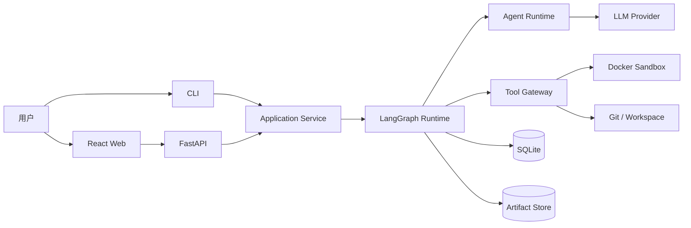
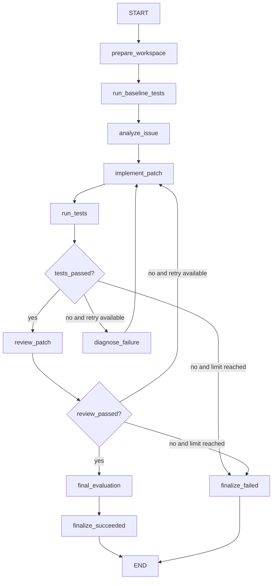

# EvoDev V0.1 系统架构设计

## 1. 文档信息

- 版本：V0.1
- 状态：已冻结
- 适用期限：2026 年 9 月 1 日至 9 月 6 日
- 目标：在一周内交付可运行、可演示、可验证的多智能体软件修复系统

## 2. 系统要解决的问题

EvoDev V0.1 不以“创建多个 Agent”为最终目标，而是解决以下问题：

> 如何让 Agent 在真实代码仓库中形成可执行、可验证、可回溯的软件修复闭环，并为后续经验学习和自进化保留结构化数据。

核心产品闭环：

```text
本地 Git 仓库 + Issue + 测试命令
                  ↓
              仓库准备
                  ↓
              Issue 分析
                  ↓
              代码修改
                  ↓
              真实测试
                  ↓
        失败分析与有限次修复
                  ↓
              Patch Review
                  ↓
      Patch + 测试证据 + 完整轨迹
```

## 3. V0.1 范围

### 3.1 支持范围

- 本地 Git 仓库。
- Python 3.13 项目。
- `pytest` 测试体系。
- 用户显式提供的 Issue 文本和测试命令。
- 单机、单任务 Worker。
- Docker 隔离执行。
- 固定的 Bug Fix Workflow。
- 最多两次自动修复。
- 基于标签的 Experience 存储和检索。

### 3.2 不在范围内

- 从 GitHub 自动接收 Issue 或提交 PR。
- 多语言仓库。
- 并行执行多个任务。
- 生产级账号、权限和多租户。
- Prompt、Skill 和 Workflow 的自动进化。
- SWE-bench 全量评测。
- 分布式执行和云端部署。

## 4. 架构原则

1. **Agent 只负责需要推理的工作**，测试、Git、文件和命令执行由确定性服务完成。
2. **最终结果由真实测试决定**，LLM Reviewer 不能单独宣告任务成功。
3. **原始仓库不被修改**，所有写操作发生在任务工作区中。
4. **工作流显式化**，分支、循环、重试与终止条件由 LangGraph 表达。
5. **业务模型不依赖 LangGraph**，通过 `WorkflowSpec` 和编译层将 EvoDev 业务对象转换为 Graph。
6. **状态与大文件分离**，Graph State 保存结构化状态和 Artifact ID，大型日志保存在 Artifact Store。
7. **所有步骤可回溯**，Agent、Prompt、Workflow、工具和评测结果都必须带版本与运行标识。
8. **有界运行**，Agent 调用、命令执行和修复循环都有预算、超时或次数限制。

## 5. 系统上下文



## 6. 分层架构

### 6.1 接入层

- React Web：创建任务、查看进度、轨迹、测试结果和 Diff。
- FastAPI：提供 HTTP API 和健康检查。
- Typer CLI：提供无前端的本地调试入口。

### 6.2 应用层

- TaskService：创建任务、校验输入。
- RunService：启动、查询和取消 TaskRun。
- ArtifactService：保存与读取 Patch、日志和测试报告。
- ExperienceService：存储和检索可复用经验。

### 6.3 工作流层

- WorkflowSpec：EvoDev 自有的声明式工作流定义。
- LangGraphCompiler：将 WorkflowSpec 编译为 `StateGraph`。
- Nodes：封装 Agent 或确定性业务步骤。
- Routers：根据测试、Review 和迭代次数选择下一节点。
- Checkpointer：保存每个 TaskRun 的 Graph 状态。

### 6.4 Agent 层

- Analyst Agent：需求理解、定位相关代码、输出修改计划。
- Developer Agent：使用受控工具搜索、读取、修改和检查代码。
- Failure Analyzer：根据命令输出和测试日志提取失败原因与修复建议。
- Reviewer Agent：评估需求覆盖、Patch 范围、测试覆盖和回归风险。

### 6.5 工具与执行层

- WorkspaceManager：仓库校验、任务工作区和清理。
- RepositoryTools：文件树、文本搜索和文件读取。
- EditTools：受控 Patch 应用。
- GitTools：基准 Commit、Diff、变更文件和 Patch。
- CommandRunner：命令执行、超时、输出截断和退出码。
- DockerSandbox：隔离运行命令和测试。

### 6.6 评测层

- BaselineEvaluator：记录修改前测试状态。
- TestEvaluator：解析目标测试和回归测试。
- PatchEvaluator：统计变更文件、行数和 Patch 大小。
- RunEvaluator：汇总成功状态、耗时、Token 和重试次数。

### 6.7 持久化与观测层

- SQLite：任务、运行、Agent 版本、Workflow 版本、Experience 和指标。
- SQLite Checkpointer：LangGraph 线程状态。
- Artifact Store：日志、Patch、测试报告和较大输出。
- Event Trace：按时间记录节点、Agent、工具和状态变化。

## 7. LangGraph 工作流



### 7.1 状态转换

```text
CREATED
→ PREPARING
→ BASELINE_TESTING
→ ANALYZING
→ IMPLEMENTING
→ TESTING
→ DEBUGGING | REVIEWING | FAILED
→ IMPLEMENTING | FINALIZING
→ SUCCEEDED | FAILED | CANCELLED
```

### 7.2 路由规则

- 测试通过：进入 Review。
- 测试失败且 `iteration < max_iterations`：进入 Failure Analyzer。
- 测试失败且达到限制：任务失败。
- Review 通过：进入最终评测。
- Review 不通过且尚有重试额度：返回 Developer。
- 收到取消信号：进入 `CANCELLED`。
- 不可恢复的基础设施错误：进入 `FAILED` 并保留原因。

## 8. Graph State

```python
class EvoDevState(TypedDict):
    run_id: str
    task_id: str
    status: str

    repository_path: str
    workspace_path: str | None
    base_commit: str | None
    issue_title: str
    issue_body: str
    test_command: str

    repository_summary: dict | None
    issue_analysis: dict | None
    implementation_plan: dict | None
    failure_analysis: dict | None
    review_result: dict | None

    baseline_result_id: str | None
    test_result_id: str | None
    patch_artifact_id: str | None
    evaluation_result_id: str | None

    changed_files: list[str]
    retrieved_experience_ids: list[str]

    iteration: int
    max_iterations: int
    tests_passed: bool | None
    review_passed: bool | None
    error_code: str | None
    error_message: str | None
```

Graph State 不保存：

- 完整仓库文件内容。
- 完整测试日志。
- 大型 Git Diff。
- 完整 Agent 上下文。

这些数据由 Artifact Store 保存，State 只保存 ID 和摘要。

## 9. 节点输入输出契约

| 节点 | 类型 | 主要输入 | 主要输出 |
|---|---|---|---|
| prepare_workspace | 确定性 | repository_path | workspace_path、base_commit |
| run_baseline_tests | 确定性 | workspace_path、test_command | baseline_result_id |
| analyze_issue | Agent | Issue、仓库摘要、Experience | issue_analysis、implementation_plan |
| implement_patch | Agent/Subgraph | 实现计划、失败分析、Tools | changed_files、patch_artifact_id |
| run_tests | 确定性 | workspace_path、test_command | test_result_id |
| diagnose_failure | Agent | 测试摘要、Diff、计划 | failure_analysis |
| review_patch | Agent | Issue、Diff 摘要、测试结果 | review_result |
| final_evaluation | 确定性 | 测试、Patch、轨迹和成本 | evaluation_result_id |
| finalize_succeeded | 确定性 | 评测结果 | SUCCEEDED |
| finalize_failed | 确定性 | 错误和当前产物 | FAILED |

## 10. Agent 定义

```python
class AgentDefinition:
    id: str
    name: str
    role: str
    prompt_version: str
    model: str
    temperature: float
    allowed_tools: list[str]
    output_schema: str
    max_tool_calls: int
    timeout_seconds: int
```

约束：

- Agent 不能访问未授权工具。
- Agent 结果必须通过 Pydantic Schema 校验。
- Agent 不能以自然语言宣告测试成功。
- Agent 调用记录模型、Prompt 版本、Token、耗时和工具调用。
- Developer 的文件写入必须通过 Tool Gateway。

## 11. 核心数据模型

### 11.1 Task

```text
id
repository_path
issue_title
issue_body
test_command
constraints
created_at
```

### 11.2 TaskRun

```text
id
task_id
status
workflow_version_id
started_at
finished_at
current_node
iteration
max_iterations
error_code
error_message
```

### 11.3 AgentVersion

```text
id
agent_name
version
prompt_version
model
tool_policy
created_at
```

### 11.4 AgentInvocation

```text
id
run_id
agent_version_id
node_name
input_artifact_id
output_artifact_id
prompt_tokens
completion_tokens
duration_ms
status
created_at
```

### 11.5 ToolInvocation

```text
id
run_id
agent_invocation_id
tool_name
arguments_summary
result_artifact_id
exit_code
duration_ms
status
created_at
```

### 11.6 TestExecution

```text
id
run_id
kind
command
exit_code
passed
duration_ms
output_artifact_id
created_at
```

### 11.7 Experience

```text
id
source_run_id
task_type
tags
failure_pattern
lesson
recommended_actions
usage_count
created_at
```

### 11.8 EvaluationResult

```text
id
run_id
resolved
baseline_passed
tests_passed
review_passed
changed_files_count
added_lines
deleted_lines
retry_count
prompt_tokens
completion_tokens
duration_ms
created_at
```

## 12. API 草案

### 12.1 系统

| 方法 | 路径 | 说明 |
|---|---|---|
| GET | `/api/health` | 健康检查 |

### 12.2 任务

| 方法 | 路径 | 说明 |
|---|---|---|
| POST | `/api/tasks` | 创建任务 |
| GET | `/api/tasks` | 查询任务列表 |
| GET | `/api/tasks/{task_id}` | 查询任务详情 |
| POST | `/api/tasks/{task_id}/runs` | 启动一次执行 |

### 12.3 运行

| 方法 | 路径 | 说明 |
|---|---|---|
| GET | `/api/runs/{run_id}` | 查询运行状态 |
| POST | `/api/runs/{run_id}/cancel` | 取消运行 |
| GET | `/api/runs/{run_id}/events` | 查询执行事件 |
| GET | `/api/runs/{run_id}/tests` | 查询测试记录 |
| GET | `/api/runs/{run_id}/diff` | 查询 Git Diff |
| GET | `/api/runs/{run_id}/evaluation` | 查询最终评测 |

### 12.4 Experience

| 方法 | 路径 | 说明 |
|---|---|---|
| GET | `/api/experiences` | 查询经验列表 |
| GET | `/api/experiences/{experience_id}` | 查询经验详情 |

### 12.5 创建任务请求

```json
{
  "repository_path": "/absolute/path/to/repository",
  "issue_title": "Expired token returns HTTP 500",
  "issue_body": "Return HTTP 401 and add a regression test.",
  "test_command": "pytest -q",
  "constraints": ["Keep the patch minimal"],
  "max_iterations": 2
}
```

## 13. Docker 沙箱方案

### 13.1 执行模式

- 每个 TaskRun 创建独立工作区。
- 工作区以读写方式挂载到容器 `/workspace`。
- 代码读写与测试均针对该任务工作区。
- 基础镜像使用 `python:3.13-slim`。
- V0.1 允许在准备阶段安装任务依赖，正式执行阶段默认关闭网络。

### 13.2 默认限制

```text
network: none
cpus: 2
memory: 2 GiB
pids-limit: 256
command-timeout: 120 seconds
max-output: 1 MiB per command
working-directory: /workspace
```

### 13.3 安全约束

- 不挂载 Docker Socket。
- 不挂载用户主目录。
- 不向容器传递无关环境变量和密钥。
- 不使用 `--privileged`。
- 容器不能修改原始仓库。
- 所有命令记录调用者、参数、退出码和耗时。

## 14. WorkflowSpec 与 LangGraph 隔离

```yaml
id: bug_fix
version: 1
entrypoint: prepare_workspace
nodes:
  - prepare_workspace
  - run_baseline_tests
  - analyze_issue
  - implement_patch
  - run_tests
  - diagnose_failure
  - review_patch
  - final_evaluation
  - finalize_succeeded
  - finalize_failed
edges:
  - source: prepare_workspace
    target: run_baseline_tests
  - source: run_baseline_tests
    target: analyze_issue
  - source: analyze_issue
    target: implement_patch
  - source: implement_patch
    target: run_tests
  - source: diagnose_failure
    target: implement_patch
  - source: final_evaluation
    target: finalize_succeeded
routes:
  - source: run_tests
    router: route_after_tests
    targets: [review_patch, diagnose_failure, finalize_failed]
  - source: review_patch
    router: route_after_review
    targets: [final_evaluation, implement_patch, finalize_failed]
terminal_nodes:
  - finalize_succeeded
  - finalize_failed
limits:
  max_repair_iterations: 2
  max_review_iterations: 1
```

原则：

- 运行记录保存 WorkflowSpec 版本。
- 已启动的 TaskRun 不切换 Workflow 版本。
- 未来 Workflow Evolution 修改 WorkflowSpec，再编译为新 Graph。
- 不允许 Evolution 模块直接修改正在运行的 Compiled Graph。

## 15. 代码目录规划

```text
EvoDev/
├── docs/
├── src/evodev/
│   ├── api/
│   ├── application/
│   ├── domain/
│   ├── workflows/
│   │   ├── nodes/
│   │   ├── routers.py
│   │   └── compiler.py
│   ├── agents/
│   ├── tools/
│   ├── runtime/
│   ├── evaluation/
│   ├── persistence/
│   └── observability/
├── tests/
├── frontend/
├── sandbox/
├── artifacts/
├── data/
├── pyproject.toml
└── README.md
```

## 16. 技术栈

| 领域 | V0.1 选择 |
|---|---|
| 后端语言 | Python 3.13 |
| API | FastAPI |
| 数据校验 | Pydantic |
| Agent 工作流 | LangGraph Graph API |
| 单 Agent 工具循环 | LangChain `create_agent` 或可替换 Agent Runtime |
| LLM 适配 | LiteLLM，对上层暴露统一接口 |
| 业务数据 | SQLite + SQLAlchemy |
| Graph Checkpoint | LangGraph SQLite Checkpointer |
| CLI | Typer |
| 命令执行 | Python subprocess + Docker CLI |
| 沙箱 | Docker |
| 日志 | structlog |
| 后端测试 | pytest |
| 前端 | React + TypeScript + Vite |
| 前端测试 | Vitest |

## 17. 配置

通过环境变量或 `.env` 配置：

```text
EVODEV_ENV
EVODEV_DATABASE_URL
EVODEV_ARTIFACTS_DIR
EVODEV_WORKSPACES_DIR
EVODEV_SANDBOX_IMAGE
EVODEV_COMMAND_TIMEOUT_SECONDS
EVODEV_MAX_COMMAND_OUTPUT_BYTES
EVODEV_LLM_MODEL
EVODEV_LLM_API_KEY
EVODEV_LLM_BASE_URL
```

`.env` 不进入版本库，项目只提供 `.env.example`。

## 18. 错误分类

| 错误类型 | 处理方式 |
|---|---|
| INVALID_TASK | 拒绝创建任务 |
| INVALID_REPOSITORY | 终止运行 |
| WORKSPACE_PREPARE_FAILED | 终止运行并保留日志 |
| SANDBOX_UNAVAILABLE | 终止运行，提示启动 Docker |
| COMMAND_TIMEOUT | 记录失败，根据节点决定重试 |
| LLM_AUTH_FAILED | 终止并提示配置密钥 |
| LLM_OUTPUT_INVALID | 允许一次结构化输出修复 |
| TEST_FAILED | 进入失败分析或在达到上限后终止 |
| REVIEW_REJECTED | 返回修改或在达到上限后终止 |
| INTERNAL_ERROR | 终止并保留完整轨迹 |

## 19. 今日冻结的架构决策

1. 首版使用 LangGraph Graph API 作为 Agent 工作流运行时。
2. 使用 `WorkflowSpec + LangGraphCompiler` 隔离 EvoDev 业务与 LangGraph API。
3. 系统采用模块化单体，不拆分微服务。
4. 首版只支持本地 Python + pytest 仓库。
5. 修改代码和执行测试必须通过受控工具与 Docker 沙箱。
6. 测试执行是确定性节点，不是 Agent。
7. 使用 SQLite 保存业务数据和开发阶段 Checkpoint。
8. V0.1 仅实现 Experience Evolution，Agent 和 Workflow Evolution 只保留版本接口。
9. 9 月 5 日晚冻结核心代码，9 月 6 日只用于验收和包装。

## 20. V0.1 架构验收标准

- 任务可从 API 或 CLI 创建。
- LangGraph 可执行完整 Bug Fix Workflow。
- 测试失败可进入有界修复循环。
- 运行中断后 Graph State 可从 Checkpoint 读取。
- 原始仓库不被 Agent 直接修改。
- 测试在 Docker 沙箱中执行。
- 每个 Agent 和工具调用均有轨迹。
- 任务结束时输出 Patch、测试证据和评测结果。
- 失败任务可生成并保存 Experience。
- 前端可查看任务进度、Agent Trace、测试结果和 Git Diff。
