# EvoDev 多智能体闭环说明

## 1. 本阶段目标

本阶段将已有的工作区、Docker 测试和代码工具接入 LangGraph，使系统能够执行以下闭环：

```text
创建隔离工作区
  → 运行基准测试
  → Analyst 分析问题
  → Developer 修改代码
  → Docker 中运行 pytest
  → 失败时分析原因并重新修改（最多三次）
  → 测试通过后 Reviewer 审查
  → 保存 Git Patch 和最终评测
```

模型只负责代码分析、修改方案、失败诊断和代码审查。仓库复制、补丁应用、测试执行、
次数判断和产物保存均由确定性代码完成。

## 2. Agent 职责

| Agent | 中文职责 | 可用工具 | 结构化输出 |
|---|---|---|---|
| Analyst | 理解问题、定位可能相关文件并制定修改步骤 | 文件列表、文件读取、文本搜索、Git Diff | `IssueAnalysis` |
| Developer | 根据分析和失败反馈完成最小代码修改 | 文件列表、文件读取、文本搜索、补丁应用、Git Diff、沙箱命令 | `ImplementationResult` |
| Failure Analyzer | 根据真实测试日志解释失败原因并提出下一轮修改建议 | 文件读取、文本搜索、Git Diff | `FailureAnalysis` |
| Reviewer | 检查需求覆盖、补丁范围和回归风险 | 文件读取、文本搜索、Git Diff | `ReviewResult` |

每次 Agent 调用都会记录角色版本、Prompt 版本、模型名称、工具调用、结构化输出和 Token
数量。Agent 只能调用角色配置中明确授权的工具。

## 3. 结构化输出字段

### 3.1 IssueAnalysis

| 字段 | 中文含义 |
|---|---|
| `problem_summary` | 对当前问题的简要概括 |
| `likely_root_cause` | 最可能的根本原因 |
| `relevant_files` | 可能需要查看或修改的文件 |
| `implementation_steps` | 建议执行的修改步骤 |
| `risks` | 修改时需要注意的风险 |

### 3.2 ImplementationResult

| 字段 | 中文含义 |
|---|---|
| `summary` | 本轮代码修改说明 |
| `changed_files` | 本轮涉及的文件 |
| `patch` | Agent 返回的可选 Git Patch；实际应用仍由受控工具完成 |

### 3.3 FailureAnalysis

| 字段 | 中文含义 |
|---|---|
| `failure_summary` | 测试失败现象摘要 |
| `root_cause` | 本轮失败的根本原因 |
| `suggested_changes` | 下一轮建议修改的内容 |
| `retryable` | 当前失败是否适合继续自动修复 |

### 3.4 ReviewResult

| 字段 | 中文含义 |
|---|---|
| `passed` | 当前补丁是否通过审查 |
| `summary` | 审查结论摘要 |
| `requirement_coverage` | 已覆盖的需求 |
| `risks` | 仍可能存在的风险 |
| `required_changes` | 未通过时必须继续完成的修改 |

## 4. 状态与产物

LangGraph 状态只保存任务参数、当前轮次、判断结果和产物标识，不直接保存完整测试日志或
大型代码差异。每次运行的文件保存在 `outputs/<run_id>/`：

| 产物 | 内容 |
|---|---|
| `baseline-test.json` | 修改前的基准测试结果 |
| `test-<轮次>.json` | 每轮修改后的测试结果 |
| `<Agent>-<轮次>.json` | Agent 配置、工具调用、输出和 Token 统计 |
| `result.patch` | 最终标准 Git Patch |
| `evaluation.json` | 最终测试、审查、文件和轮次摘要 |

LangGraph 检查点保存到 `EVODEV_DATABASE_URL` 指定的 SQLite 数据库，并使用 `run_id`
作为 `thread_id`，便于后续查询和恢复运行状态。

## 5. 模型配置

复制 `.env.example` 为 `.env`，然后填写以下配置：

```dotenv
EVODEV_LLM_MODEL=deepseek/deepseek-v4-flash
EVODEV_LLM_API_KEY=模型服务访问密钥
EVODEV_LLM_BASE_URL=https://api.deepseek.com
```

当前选择 DeepSeek 的 `deepseek-v4-flash`，该模型支持 JSON 输出和工具调用；LiteLLM
配置中的 `deepseek/` 是服务商前缀。真实密钥只保存在本地 `.env` 中，不应提交到 Git。

## 6. 执行命令

```bash
uv run evodev repair \
  --repository /绝对路径/示例仓库 \
  --issue-title "问题标题" \
  --issue-body "问题描述" \
  --test-command "pytest -q" \
  --max-iterations 3
```

默认模式会显示中文执行阶段和简洁结果摘要。需要查看 Docker 容器、命令参数和耗时等
底层信息时添加 `--verbose`；需要完整状态 JSON 时添加 `--json`：

```bash
uv run evodev repair [其他参数] --verbose
uv run evodev repair [其他参数] --json
```

`--json` 会隐藏过程日志，使标准输出只包含最终 JSON，便于保存或交给其他程序处理。
无论使用哪种显示模式，源仓库都保持不变，代码修改只发生在隔离工作区中。

## 7. 本次真实联调结果

2026 年 9 月 3 日使用 `deepseek/deepseek-v4-flash` 重新执行了本节全部步骤。测试对象是
项目自带的错误计算器，运行编号为 `4a1360e84a464c7ab9a2b1bdcc950c3b`。截图均来自本次
真实终端运行，没有使用模拟日志，也没有展示 API 密钥。

| 验证项 | 真实结果 |
|---|---|
| 缺陷基准测试 | 2 个测试失败 |
| 自动修复 | 第一轮将 `left - right` 修正为 `left + right` |
| 修复后测试 | 通过 |
| Reviewer | 通过 |
| 源仓库保护 | 源仓库变更数量为 0 |
| 最终 Patch | 通过 `git apply --check` |
| LangGraph 检查点 | 清理前保存 10 条 |
| 项目回归测试 | 49 个测试通过，出现 1 条第三方弃用警告 |
| 测试环境清理 | 临时仓库、工作区、运行输出、检查点和 Docker 镜像均已删除 |

## 8. 手动测试完整流程

以下命令均在 EvoDev 项目根目录执行。流程会真实调用 DeepSeek API，并创建 Docker
镜像、临时 Git 仓库、隔离工作区、运行输出和 SQLite 检查点。最后两个步骤负责清理和
复核这些测试资源。

> 截图中的绝对路径、运行编号和耗时来自 2026 年 9 月 3 日的实测环境；在其他电脑上
> 执行时会不同。

### 8.1 同步 Python 依赖

```bash
uv sync --dev
```

看到依赖解析和检查完成，且命令没有报错，即表示 Python 环境已准备好。

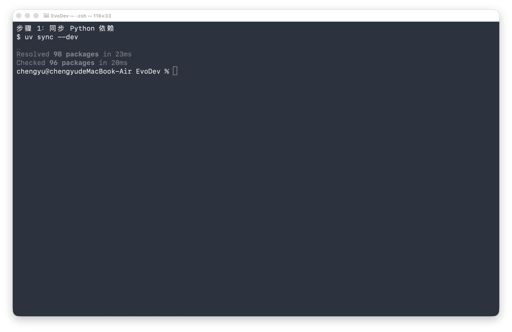

### 8.2 构建 Docker 沙箱镜像

先启动 Docker Desktop，再执行：

```bash
docker build -t evodev-python:3.13 sandbox
```

输出中出现 `FINISHED`，并成功命名为 `evodev-python:3.13`，表示镜像可用。

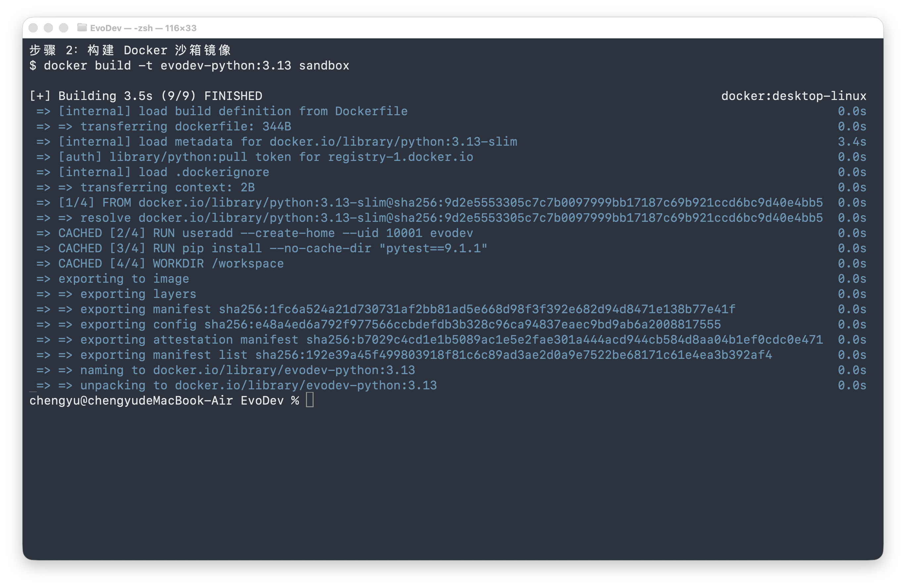

### 8.3 检查本地运行环境

```bash
uv run evodev doctor
```

重点确认以下三个字段为 `true`：

```text
docker_available
llm_model_configured
llm_api_key_configured
```

如果模型密钥未配置，请在本地 `.env` 中填写 `EVODEV_LLM_API_KEY`，不要把真实密钥写入
`.env.example` 或提交到 Git。

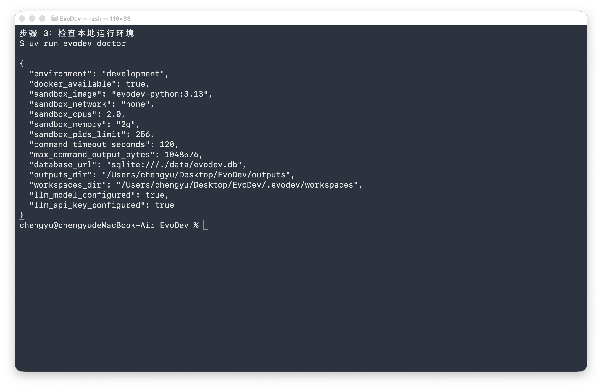

### 8.4 创建独立的错误示例仓库

先记录项目根目录，再复制项目自带示例并初始化临时 Git 仓库：

```bash
PROJECT_ROOT="$(pwd)"
DEMO_DIR="$(mktemp -d /tmp/evodev-demo.XXXXXX)"
cp examples/buggy-calculator/calculator.py "$DEMO_DIR/"
cp examples/buggy-calculator/test_calculator.py "$DEMO_DIR/"
git -C "$DEMO_DIR" init
git -C "$DEMO_DIR" add calculator.py test_calculator.py
git -C "$DEMO_DIR" -c user.name="EvoDev Demo" \
  -c user.email="demo@evodev.local" commit -m "初始化错误示例"
git -C "$DEMO_DIR" log --oneline -1
```

后续步骤继续使用当前终端中的 `PROJECT_ROOT` 和 `DEMO_DIR`，不要关闭终端。

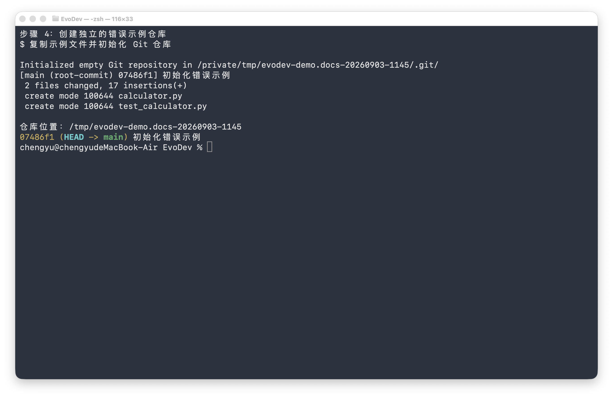

### 8.5 运行修复前的缺陷基准测试

```bash
docker run --rm \
  --network none \
  --volume "$DEMO_DIR:/workspace:ro" \
  --workdir /workspace \
  evodev-python:3.13 pytest -q -p no:cacheprovider
```

预期结果是两个测试失败，因为示例中的 `add` 函数错误地执行了减法。这里关闭 pytest
缓存，是为了避免只读仓库产生无关的缓存写入警告；此步骤失败正是正确的基准结果。

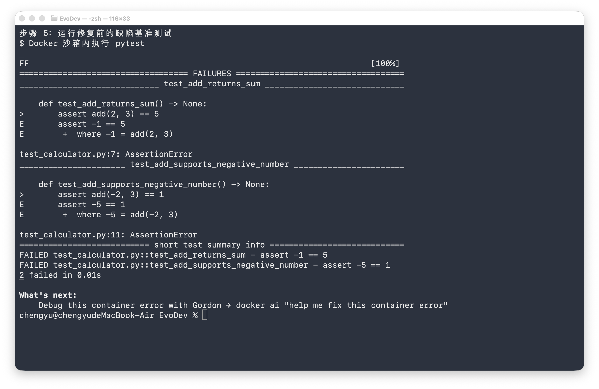

### 8.6 执行 DeepSeek 多智能体修复

```bash
uv run evodev repair \
  --repository "$DEMO_DIR" \
  --issue-title "修复 add 函数的加法错误" \
  --issue-body "calculator.py 中的 add(left, right) 应返回两个整数之和。请保持公开函数签名不变，并确保现有测试全部通过。" \
  --test-command "pytest -q" \
  --max-iterations 3
```

运行时应依次看到准备工作区、基准测试、问题分析、代码修改、修改后测试、代码审查和
生成 Patch。最终摘要应显示任务、测试和审查均成功。该步骤会真实调用模型并产生少量
Token 费用。

把摘要中的运行编号保存到当前终端，后续检查和清理都依赖该值：

```bash
RUN_ID="把这里替换为实际运行编号"
```

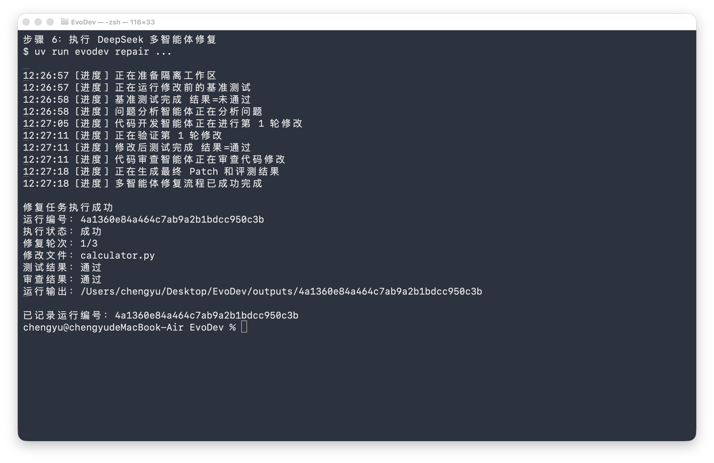

### 8.7 检查测试结果和输出文件

```bash
uv run python -m json.tool "outputs/$RUN_ID/baseline-test.json"
uv run python -m json.tool "outputs/$RUN_ID/test-1.json"
find "outputs/$RUN_ID" -maxdepth 1 -type f -print | sort
```

基准测试中的 `passed` 应为 `false`、`exit_code` 应为 `1`；第一轮修复测试中的 `passed`
应为 `true`、`exit_code` 应为 `0`。目录中还应存在 Agent 轨迹、最终 Patch 和评测结果。

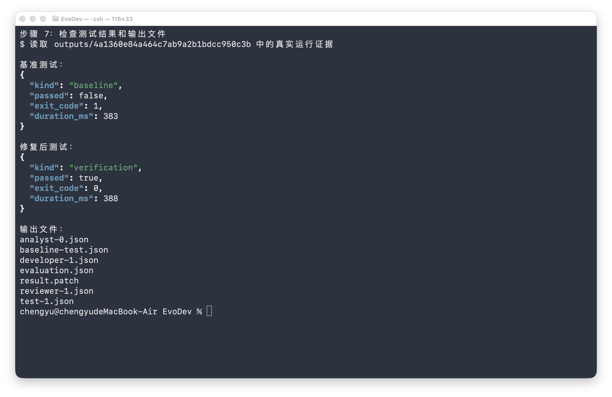

### 8.8 检查 Agent 运行轨迹

```bash
uv run python -m json.tool "outputs/$RUN_ID/analyst-0.json"
uv run python -m json.tool "outputs/$RUN_ID/developer-1.json"
uv run python -m json.tool "outputs/$RUN_ID/reviewer-1.json"
```

重点检查每份记录中的角色、模型、Prompt 版本、工具调用和结构化输出。本次实测中
Analyst、Developer 和 Reviewer 各运行一次；若触发重试，还会产生 Failure Analyzer 和
后续轮次记录。

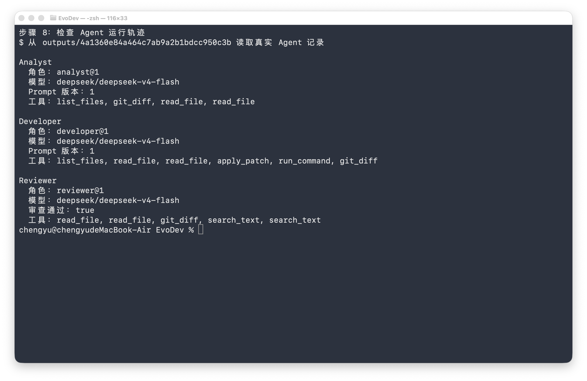

### 8.9 检查 Patch、源仓库保护和 LangGraph 检查点

```bash
git -C ".evodev/workspaces/$RUN_ID" diff
git -C "$DEMO_DIR" status --short
sqlite3 data/evodev.db \
  "SELECT COUNT(*) FROM checkpoints WHERE thread_id = '$RUN_ID';"
git -C "$DEMO_DIR" apply --check \
  "$PROJECT_ROOT/outputs/$RUN_ID/result.patch"
```

隔离工作区应只包含将减法改为加法的一行变更；源仓库状态命令应没有输出；检查点数量
应大于零；`git apply --check` 应成功且没有错误信息。

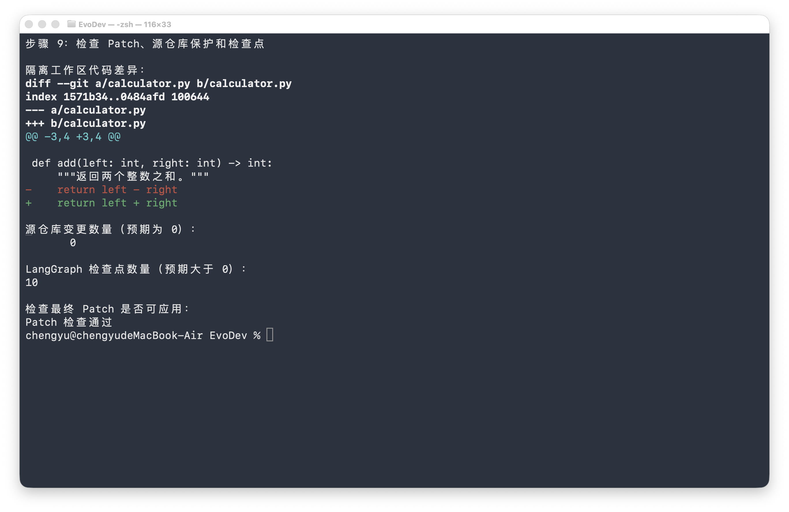

### 8.10 运行项目完整回归测试

```bash
uv run pytest -q
```

本次实测结果为 `49 passed, 1 warning`。警告来自 Starlette 测试客户端的第三方弃用提示，
不影响当前测试结果。

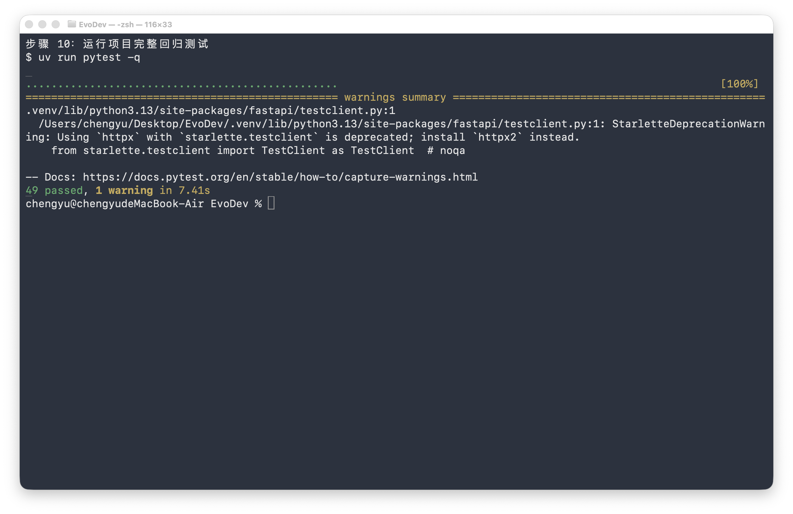

### 8.11 删除本次测试环境

确认前面的运行证据已检查完成后，执行：

```bash
uv run evodev cleanup-demo \
  --run-id "$RUN_ID" \
  --demo-repository "$DEMO_DIR" \
  --remove-image
```

该命令只按指定运行编号删除对应工作区、运行输出和 LangGraph 检查点，并且只允许删除
系统临时目录中名称以 `evodev-demo.` 开头的 Git 仓库。`--remove-image` 还会删除
`evodev-python:3.13` 镜像，以释放更多磁盘空间；如果还要继续测试，可以省略该参数。

清理会删除 `outputs/$RUN_ID` 中的运行证据，因此应在完成第 7 至第 9 步后再执行。本文的
截图保留了本次已清理运行的人工复查证据。

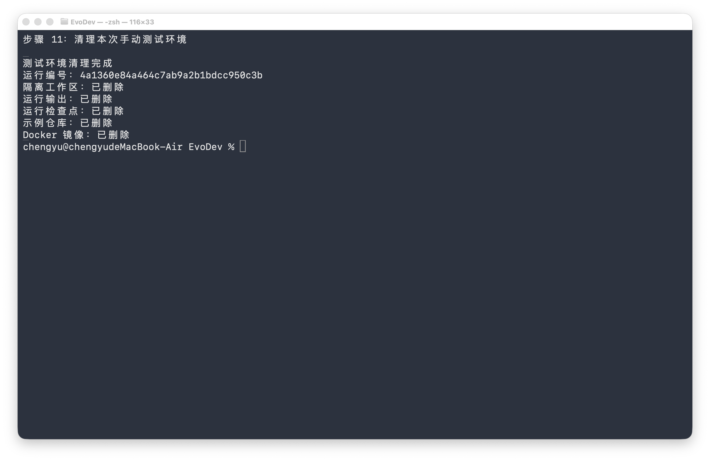

### 8.12 确认测试环境已删除

```bash
test ! -d "$DEMO_DIR" && echo "[通过] 临时示例仓库已删除"
test ! -d "outputs/$RUN_ID" && echo "[通过] 本次运行输出已删除"
test ! -d ".evodev/workspaces/$RUN_ID" && echo "[通过] 本次运行工作区已删除"
CHECKPOINT_COUNT="$(sqlite3 data/evodev.db \
  "SELECT COUNT(*) FROM checkpoints WHERE thread_id = '$RUN_ID';")"
test "$CHECKPOINT_COUNT" = "0" && echo "[通过] 本次运行检查点已删除"
if ! docker image inspect evodev-python:3.13 >/dev/null 2>&1; then
  echo "[通过] 测试沙箱镜像已删除"
fi
```

五项均应输出“通过”。如果第 11 步省略了 `--remove-image`，则 Docker 镜像仍然存在是
正常结果，此时不需要执行最后一个检查。

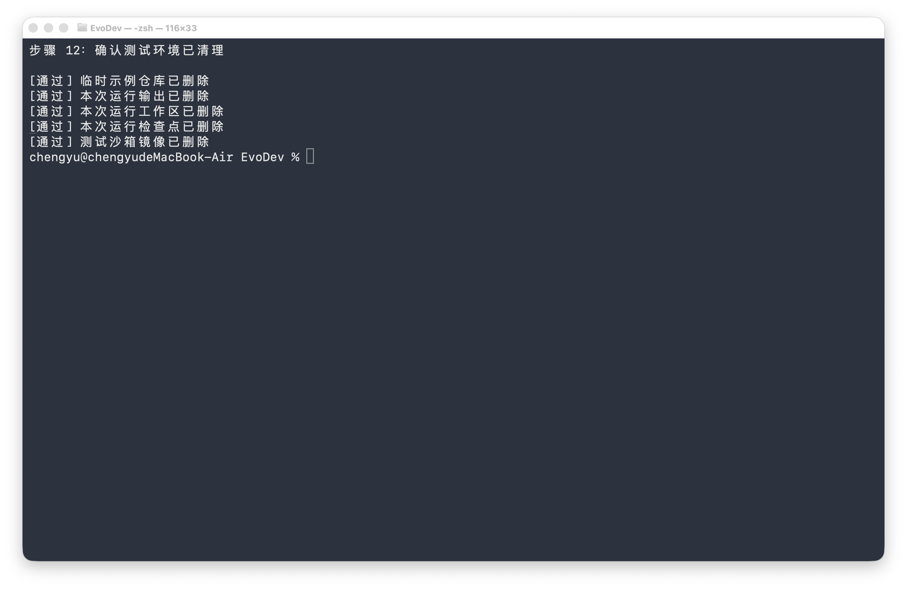

### 8.13 常见失败检查

- `docker_available` 为 `false`：确认 Docker Desktop 已启动，再执行 `docker info`。
- `llm_api_key_configured` 为 `false`：检查 `.env` 中的 DeepSeek 密钥是否位于等号后。
- 最终状态为“失败”：查看摘要中的错误代码和失败原因，再检查当前运行目录下的测试与
  Agent JSON 记录。
- 没有 `result.patch`：只有测试和代码审查均通过的任务才会生成最终 Patch。
- 清理命令拒绝示例仓库：确认它位于系统临时目录、名称以 `evodev-demo.` 开头且包含
  `.git` 目录；安全校验不会删除普通项目仓库。
