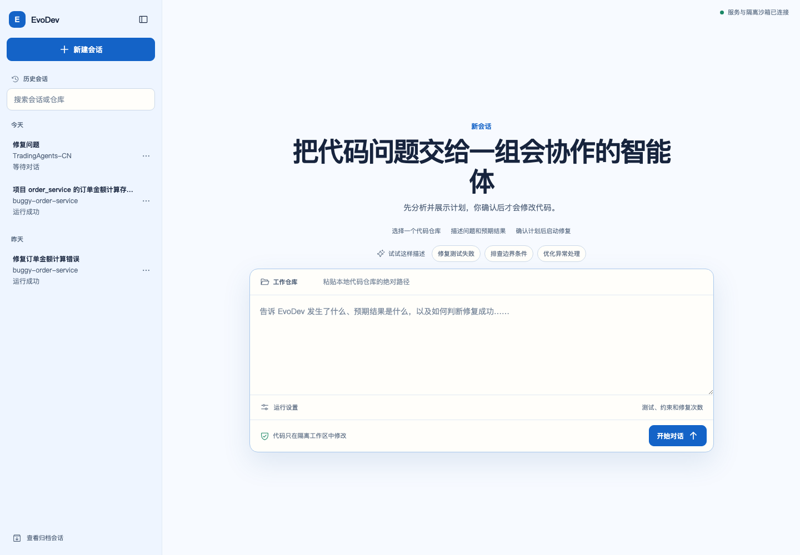
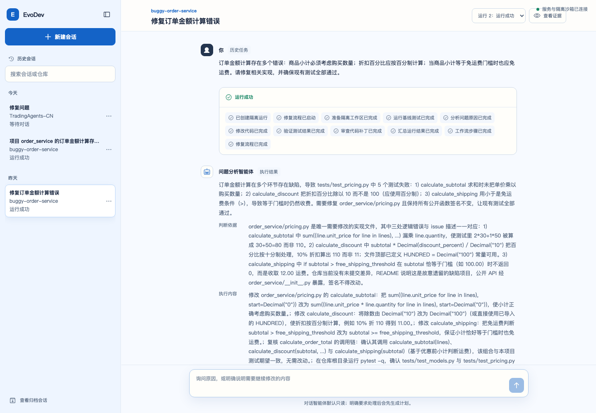
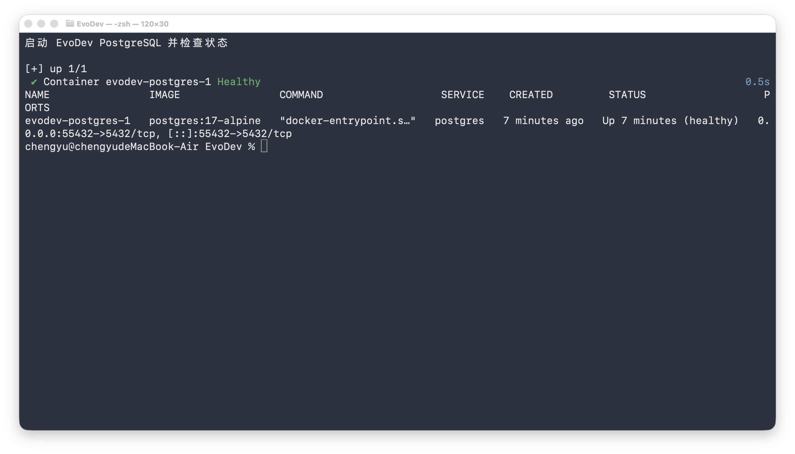

# EvoDev 手动测试指南

## 新版网页验收截图

2026 年 9 月 5 日使用本机正在运行的前后端和 PostgreSQL 数据生成以下截图。截图中的
运行结果来自真实修复记录，不是前端模拟数据；历史终端步骤仍保留在后续章节中。






## 1. 本次真实联调结果

2026 年 9 月 3 日使用 `deepseek/deepseek-v4-flash` 重新执行了本节全部步骤。测试对象是
项目自带的错误计算器，运行编号为 `4a1360e84a464c7ab9a2b1bdcc950c3b`。截图均来自本次
真实终端运行，没有使用模拟日志，也没有展示 API 密钥。

完成本次优化后，又使用 PostgreSQL 和外部 Prompt 模板执行了真实回归运行
`f22ac91e9ff743e18dffae08845567e7`：三个实际调用的 Agent 均记录 Prompt 版本 `2`，修复
第一轮成功，PostgreSQL 保存 10 条检查点，最后按运行编号完成清理。包含 Docker 和
PostgreSQL 的当前完整测试结果为 `55 passed, 1 warning`。

| 验证项 | 真实结果 |
|---|---|
| 缺陷基准测试 | 2 个测试失败 |
| 自动修复 | 第一轮将 `left - right` 修正为 `left + right` |
| 修复后测试 | 通过 |
| Reviewer | 通过 |
| 源仓库保护 | 源仓库变更数量为 0 |
| 最终 Patch | 通过 `git apply --check` |
| LangGraph 检查点 | 清理前保存 10 条 |
| 截图对应的项目回归测试 | 49 个测试通过，出现 1 条第三方弃用警告 |
| 测试环境清理 | 临时仓库、工作区、运行输出、检查点和 Docker 镜像均已删除 |

## 2. 手动测试完整流程

以下命令均在 EvoDev 项目根目录执行。流程会真实调用 DeepSeek API，并创建 Docker
镜像、临时 Git 仓库、隔离工作区、运行输出和 PostgreSQL 检查点。最后两个步骤负责清理和
复核这些测试资源。

> 截图中的绝对路径、运行编号和耗时来自 2026 年 9 月 3 日的实测环境；在其他电脑上
> 执行时会不同。

### 2.1 启动 PostgreSQL 并同步 Python 依赖

```bash
docker compose up -d --wait postgres
uv sync --dev
```

PostgreSQL 容器状态变为 `Healthy`，并且依赖检查完成后，运行环境即准备完毕。项目使用
宿主机 `55432` 端口，避免占用本机可能已有的标准 PostgreSQL 端口。




### 2.2 构建 Docker 沙箱镜像

先启动 Docker Desktop，再执行：

```bash
docker build -t evodev-python:3.13 sandbox
```

输出中出现 `FINISHED`，并成功命名为 `evodev-python:3.13`，表示镜像可用。


### 2.3 检查本地运行环境

```bash
uv run evodev doctor
```

重点确认以下四个字段为 `true`：

```text
docker_available
database_available
llm_model_configured
llm_api_key_configured
```

如果模型密钥未配置，请在本地 `.env` 中填写 `EVODEV_LLM_API_KEY`，不要把真实密钥写入
`.env.example` 或提交到 Git。


### 2.4 创建独立的错误示例仓库

先记录项目根目录，再复制项目自带示例并初始化临时 Git 仓库：

```bash
PROJECT_ROOT="$(pwd)"
DEMO_DIR="$(mktemp -d /tmp/evodev-demo.XXXXXX)"
cp examples/buggy-calculator/calculator.py "$DEMO_DIR/"
cp examples/buggy-calculator/test_calculator.py "$DEMO_DIR/"
git -C "$DEMO_DIR" init
git -C "$DEMO_DIR" add calculator.py test_calculator.py
git -C "$DEMO_DIR" -c user.name="EvoDev Demo" \
  -c user.email="demo@evodev.local" commit -m "初始化错误示例"
git -C "$DEMO_DIR" log --oneline -1
```

后续步骤继续使用当前终端中的 `PROJECT_ROOT` 和 `DEMO_DIR`，不要关闭终端。


### 2.5 运行修复前的缺陷基准测试

```bash
docker run --rm \
  --network none \
  --volume "$DEMO_DIR:/workspace:ro" \
  --workdir /workspace \
  evodev-python:3.13 pytest -q -p no:cacheprovider
```

预期结果是两个测试失败，因为示例中的 `add` 函数错误地执行了减法。这里关闭 pytest
缓存，是为了避免只读仓库产生无关的缓存写入警告；此步骤失败正是正确的基准结果。


### 2.6 执行 DeepSeek 多智能体修复

```bash
uv run evodev repair \
  --repository "$DEMO_DIR" \
  --issue-title "修复 add 函数的加法错误" \
  --issue-body "calculator.py 中的 add(left, right) 应返回两个整数之和。请保持公开函数签名不变，并确保现有测试全部通过。" \
  --test-command "pytest -q" \
  --max-iterations 3
```

运行时应依次看到准备工作区、基准测试、问题分析、代码修改、修改后测试、代码审查和
生成 Patch。最终摘要应显示任务、测试和审查均成功。该步骤会真实调用模型并产生少量
Token 费用。

把摘要中的运行编号保存到当前终端，后续检查和清理都依赖该值：

```bash
RUN_ID="把这里替换为实际运行编号"
```


### 2.7 检查测试结果和输出文件

```bash
uv run python -m json.tool "outputs/$RUN_ID/baseline-test.json"
uv run python -m json.tool "outputs/$RUN_ID/test-1.json"
find "outputs/$RUN_ID" -maxdepth 1 -type f -print | sort
```

基准测试中的 `passed` 应为 `false`、`exit_code` 应为 `1`；第一轮修复测试中的 `passed`
应为 `true`、`exit_code` 应为 `0`。目录中还应存在 Agent 轨迹、最终 Patch 和评测结果。


### 2.8 检查 Agent 运行轨迹

```bash
uv run python -m json.tool "outputs/$RUN_ID/analyst-0.json"
uv run python -m json.tool "outputs/$RUN_ID/developer-1.json"
uv run python -m json.tool "outputs/$RUN_ID/reviewer-1.json"
```

重点检查每份记录中的角色、模型、Prompt 版本、工具调用和结构化输出。本次实测中
Analyst、Developer 和 Reviewer 各运行一次；若触发重试，还会产生 Failure Analyzer 和
后续轮次记录。


### 2.9 检查 Patch、源仓库保护和 LangGraph 检查点

```bash
git -C ".evodev/workspaces/$RUN_ID" diff
git -C "$DEMO_DIR" status --short
docker compose exec -T postgres psql -U evodev -d evodev -tAc \
  "SELECT COUNT(*) FROM checkpoints WHERE thread_id = '$RUN_ID';"
git -C "$DEMO_DIR" apply --check \
  "$PROJECT_ROOT/outputs/$RUN_ID/result.patch"
```

隔离工作区应只包含将减法改为加法的一行变更；源仓库状态命令应没有输出；检查点数量
应大于零；`git apply --check` 应成功且没有错误信息。


### 2.10 运行项目完整回归测试

```bash
uv run pytest -q
```

本次实测结果为 `49 passed, 1 warning`。警告来自 Starlette 测试客户端的第三方弃用提示，
不影响当前测试结果。


### 2.11 删除本次测试环境

确认前面的运行证据已检查完成后，执行：

```bash
uv run evodev cleanup-demo \
  --run-id "$RUN_ID" \
  --demo-repository "$DEMO_DIR" \
  --remove-image
```

该命令只按指定运行编号删除对应工作区、运行输出和 LangGraph 检查点，并且只允许删除
系统临时目录中名称以 `evodev-demo.` 开头的 Git 仓库。`--remove-image` 还会删除
`evodev-python:3.13` 镜像，以释放更多磁盘空间；如果还要继续测试，可以省略该参数。

清理会删除 `outputs/$RUN_ID` 中的运行证据，因此应在完成第 7 至第 9 步后再执行。本文的
截图保留了本次已清理运行的人工复查证据。


### 2.12 确认测试环境已删除

```bash
test ! -d "$DEMO_DIR" && echo "[通过] 临时示例仓库已删除"
test ! -d "outputs/$RUN_ID" && echo "[通过] 本次运行输出已删除"
test ! -d ".evodev/workspaces/$RUN_ID" && echo "[通过] 本次运行工作区已删除"
CHECKPOINT_COUNT="$(docker compose exec -T postgres \
  psql -U evodev -d evodev -tAc \
  "SELECT COUNT(*) FROM checkpoints WHERE thread_id = '$RUN_ID';")"
test "$CHECKPOINT_COUNT" = "0" && echo "[通过] 本次运行检查点已删除"
if ! docker image inspect evodev-python:3.13 >/dev/null 2>&1; then
  echo "[通过] 测试沙箱镜像已删除"
fi
```

五项均应输出“通过”。如果第 11 步省略了 `--remove-image`，则 Docker 镜像仍然存在是
正常结果，此时不需要执行最后一个检查。

全部检查结束后，可以删除 PostgreSQL 测试容器及其数据卷：

```bash
docker compose down --volumes
```

该命令会删除所有保存在项目 PostgreSQL 数据卷中的检查点，仅应在确认不再需要其他运行
记录时执行。如果还需要继续调试，只执行 `docker compose stop postgres` 即可保留数据卷。


### 2.13 常见失败检查

- `docker_available` 为 `false`：确认 Docker Desktop 已启动，再执行 `docker info`。
- `database_available` 为 `false`：执行 `docker compose up -d --wait postgres`，并确认宿主机
  `55432` 端口没有被其他程序占用。
- `llm_api_key_configured` 为 `false`：检查 `.env` 中的 DeepSeek 密钥是否位于等号后。
- 最终状态为“失败”：查看摘要中的错误代码和失败原因，再检查当前运行目录下的测试与
  Agent JSON 记录。
- 没有 `result.patch`：只有测试和代码审查均通过的任务才会生成最终 Patch。
- 清理命令拒绝示例仓库：确认它位于系统临时目录、名称以 `evodev-demo.` 开头且包含
  `.git` 目录；安全校验不会删除普通项目仓库。
