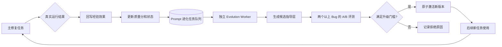

# 自进化机制说明

## 1. 自进化边界

EvoDev 的自进化由两条闭环组成：系统先根据真实任务结果调整 Experience 的质量分和检索
顺序，再由独立 Worker 从高质量经验中生成候选 Prompt，通过真实 Bug 任务 A/B 评测后决定
升级或拒绝。首版不修改工具权限、安全规则、输出 Schema 和 LangGraph 拓扑。候选指导层
还会经过确定性关键词检查；试图忽略系统约束、绕过测试、扩大工具权限或修改测试文件的候选
会在 A/B 评测前直接拒绝。



## 2. 经验策略进化

### 2.1 反馈分类

| 运行结果 | 经验反馈 | 是否影响质量分 |
|---|---|---|
| 测试和审查通过 | `success` | 是 |
| 达到修复上限或诊断为不可修复 | `failure` | 是 |
| 模型格式、Docker、数据库等基础设施错误 | `ignored` | 否 |

经验刚注入时，使用记录为 `pending`。主任务结束阶段只执行一次轻量数据库回写，不进行模型
调用，也不执行 Prompt 优化，因此不会明显增加主任务耗时。

### 2.2 质量分

质量分使用带先验的平滑成功率：

```text
quality_score = (success_count + 1) / (success_count + failure_count + 2)
```

新经验初始分为 `0.5`。检索将分级标签相关性乘以 `0.5 + quality_score`，因此历史效果好的
经验会升序、效果差的经验会降序，但质量分不能让仅命中通用标签的无关经验通过最低阈值。
累计至少三条有效反馈且质量分低于 `0.35` 时，经验状态自动变成 `disabled`，不再注入 Agent。

## 3. Prompt 进化

### 3.1 固定层和进化层

运行时 Prompt 由两部分组成：

```text
固定系统 Prompt
  - Agent 职责
  - 工具权限
  - 安全边界
  - JSON Schema

已通过评测的进化指导层
  - 从历史经验提炼的软件修复策略
```

进化过程只替换指导层。固定层继续由代码仓库中的 Markdown 文件管理，防止模型通过自我修改
扩大权限或绕过真实测试。

### 3.2 异步任务

主任务不会直接运行 Prompt 优化。用户或后续调度器只向
`evodev_prompt_evolution_jobs` 插入一条 `pending` 任务；独立 Worker 使用
`FOR UPDATE SKIP LOCKED` 原子领取，避免多个进程重复执行。

默认关闭自动投递，避免修复任务结束后意外产生模型费用。设置
`EVODEV_PROMPT_EVOLUTION_AUTO_ENQUEUE=true` 后，主任务在产生有效经验反馈时会尝试投递
Developer 进化任务；如果同角色已经存在 `pending` 或 `running` 任务，则不会重复创建。
无论是否自动投递，耗时的优化与 A/B 评测都只能由独立 Worker 执行。

```bash
uv run evodev evolve-prompt --agent developer --min-experiences 1
uv run evodev evolution-worker --once
```

持续运行 Worker：

```bash
uv run evodev evolution-worker --watch
```

### 3.3 候选生成

Prompt Optimizer 最多读取五条启用经验，并输出：优化假设、候选指导、预期效果和风险。候选
状态为 `candidate`，此时不会影响任何正式修复任务。

### 3.4 A/B 评测和升级门槛

当前版本和候选版本使用 `examples/prompt-evolution-benchmarks.json` 中完全相同的 Bug、测试
命令和最大迭代次数。评测期间关闭 Experience 检索，避免两个版本拿到不同上下文。

候选版本必须同时满足：

- 至少执行两个真实 Bug 任务。
- 不能让当前版本原本成功的任务失败。
- 成功任务数量不能下降。
- Token 总量不能增长超过 20%。
- 成功数增加、重试减少或 Token 减少，至少满足一种可验证改进。

满足条件后，数据库事务先退役旧版本，再激活候选版本；否则候选变成 `rejected` 并保存原因。
正在运行的任务已经固定了 Prompt 内容，只有后续新任务会读取新版本。

## 4. 版本查询和回滚

```bash
uv run evodev prompt-versions --agent developer
uv run evodev evolution-jobs
uv run evodev rollback-prompt --agent developer
```

回滚会重新激活上一个曾经通过评测的版本。所有 Agent 调用产物继续记录实际
`prompt_version`，例如基础版本 `3` 或进化版本 `3+e1`。

## 5. PostgreSQL 数据

| 表 | 用途 |
|---|---|
| `evodev_experiences` | 经验内容、成功/失败次数、质量分和状态 |
| `evodev_experience_usages` | 每次经验注入及最终反馈 |
| `evodev_prompt_evolution_jobs` | 独立 Worker 的任务队列和执行状态 |
| `evodev_prompt_versions` | 候选、启用、拒绝和退役的 Prompt 指导层 |

## 6. 当前能力表述

完成这两条闭环后，EvoDev 的自进化不再只是普通 RAG：历史经验的真实效果会改变未来检索
排序，而高质量经验还能生成候选 Prompt；候选版本只有在真实软件修复结果优于当前版本时才会
自动激活，并且可以审计和回滚。

## 7. 真实 DeepSeek A/B 验收记录

2026 年 9 月 4 日，经用户明确授权后，独立 Worker 使用 Experience
`8e0e4856-0413-4251-a4f1-8f3456f1c173` 生成 Developer 候选指导层，并在
`buggy-calculator`、`buggy-text-normalizer` 上完成两组基线和两组候选评测。进化任务编号为
`fd0dc528-2c30-41a2-ad09-209da43f0def`，候选版本编号为
`a39fc583-750c-4525-9221-64ea443c12d4`，显示版本为 `3+e1`。

| Prompt | 评测任务 | 结果 | 重试 | 输入 Token | 输出 Token | 耗时 |
|---|---|---:|---:|---:|---:|---:|
| 当前版本 | 修复加法运算符 | 成功 | 0 | 14,623 | 1,684 | 27,333 ms |
| 当前版本 | 修复文本规范化 | 成功 | 0 | 19,215 | 2,413 | 19,518 ms |
| 候选 `3+e1` | 修复加法运算符 | 成功 | 0 | 15,728 | 1,484 | 14,885 ms |
| 候选 `3+e1` | 修复文本规范化 | 失败 | 0 | 5,523 | 1,178 | 15,494 ms |

最终结论为“候选 Prompt 导致原本成功的任务失败”，所以候选状态变为 `rejected`，当前固定
Developer Prompt 继续生效。这次拒绝是预期的安全行为：自进化的目标是只升级经过真实验证的
改进，而不是保证每个候选都被激活。

首次预检还发现，安全规则会把“不得修改测试文件”误判为越权指导。该任务没有进入 A/B，
也没有计入上述四次评测；规则现已改为只拦截“允许、可以、通过修改测试文件”等放宽边界的
表达，并增加了正反例回归测试。真实评测同时暴露出失败样例只保存成功状态、未保存错误原因的
可观测性缺口；后续评测结果已增加 `error_code` 和 `error_message` 字段。
